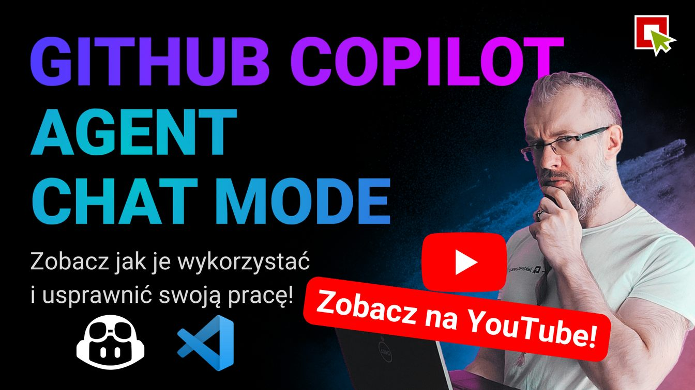

# 🤖 Awesome GitHub Copilot for Testers

This repository is a collection of resources (prompts, instructions, and chat modes) for using GitHub Copilot to enhance test automation and quality engineering workflows.

It is designed to help testers, developers, and quality engineers leverage AI to improve their testing practices, automate repetitive tasks, and enhance the overall quality of software products.

> [!TIP]
> 💡 Choose your language:
>
> - 🇬🇧 [English](./README.md)
> - 🇵🇱 [Polski](./README.pl.md)

> [!TIP]
> This project is heavily inspired by [Awesome GitHub Copilot](https://github.com/github/awesome-copilot) - a curated list of resources for using GitHub Copilot effectively.
> We have adapted the structure and content to focus specifically on testing and quality engineering, providing tailored resources for this domain.

Table of Contents

- [🎯 GitHub Copilot Customization Features](#-github-copilot-customization-features)
  - [📋 Resources](#-resources)
    - [Custom Instructions](#custom-instructions)
    - [Custom Prompt Templates](#custom-prompt-templates)
    - [Custom Chat Modes](#custom-chat-modes)
    - [Custom Agents](#custom-agents)
    - [Agent Orchestration](#agent-orchestration)
    - [Custom Sets](#custom-sets)
    - [Agent Skills](#agent-skills)
  - [📚 Additional Resources](#-additional-resources)
  - [🌱 Contributing](#-contributing)
  - [📞 Contact & Support](#-contact--support)
- [📚 Learning Resources](#-learning-resources)
  - [🇵🇱 Polish Resources](#-polish-resources)
  - [🇬🇧 English Resources](#-english-resources)

> [!IMPORTANT]
> Check out our free YouTube video to learn more about GitHub Copilot Chat Modes:
>
> [](https://www.youtube.com/watch?v=hHrOJlk6ET8&list=PLfKhn9AcZ-cCqD34AG5YRejujaBqCBgl4)

## 🎯 GitHub Copilot Customization Features

GitHub Copilot provides three main ways to customize AI responses and tailor assistance to your specific workflows, team guidelines, and project requirements:

- **Custom Instructions**: Define how Copilot should behave, what to prioritize, and how to communicate.
- **Chat Modes**: Create specialized chat modes for different roles or tasks, each with its own set of tools and instructions. With version [1.106](https://code.visualstudio.com/updates/v1_106) of VS Code, Chat Modes were renamed to **Custom Agents**.
- **Custom Agents**: Advanced chat modes that can utilize multiple instructions and tools to perform complex tasks.
- **Prompt Templates**: Predefined templates for common tasks or questions, allowing for quick and consistent responses.

> [!TIP]
> More You can learn about these features in the [official documentation](https://code.visualstudio.com/docs/copilot/overview) and:
>
> - [VS Code Copilot Customization Documentation](https://code.visualstudio.com/docs/copilot/copilot-customization) - Official Microsoft documentation
> - [Custom Instructions](https://code.visualstudio.com/docs/copilot/copilot-customization) - Tailor Copilot's behavior
> - [Custom Chat Modes](https://code.visualstudio.com/docs/copilot/chat/chat-modes) - Advanced chat configuration
> - [Custom Instructions](https://code.visualstudio.com/docs/copilot/customization/custom-instructions) - Customize Copilot's behavior
> - [Prompt Files](https://code.visualstudio.com/docs/copilot/customization/prompt-files) - Using prompt templates
> - [Custom Agents](https://code.visualstudio.com/docs/copilot/customization/custom-agents) - Advanced agent configuration
> - [Agent Skills](https://code.visualstudio.com/docs/copilot/customization/agent-skills) - Extend agent capabilities with skills
> - [Using agents in Visual Studio Code](https://code.visualstudio.com/docs/copilot/agents/overview) - Overview of agents and orchestration
> - [Subagents in Visual Studio Code](https://code.visualstudio.com/docs/copilot/agents/subagents) - Using subagents for specialized tasks

> [!TIP]
> Do you want to learn more about effective use of AI and GitHub Copilot for Testers?
>
> Check our [AI_Testers](https://aitesters.pl) Program - a comprehensive Program for mastering AI in test automation!
>
> <div align="center"><a href="https://aitesters.pl"></a></div>

## 📋 Resources

### Custom Instructions

> [!TIP]
> Usage:
>
> - copy these instructions to your `.github/copilot-instructions.md` file or
> - create task-specific `.github/.instructions.md` files in your workspace's `.github/instructions` folder
> - use `Chat: Attach Instructions` command from the command palette to apply them in the current chat

<!-- START_CUSTOM_INSTRUCTIONS -->

| Title | Description | Install |
| ----- | ----------- | ------- |
| [Playwright TypeScript Test Generation Instructions](instructions/playwright-typescript.instructions.md) | Playwright test generation instructions with best practices and patterns. | [](https://vscode.dev/redirect?url=vscode%3Achat-instructions%2Finstall%3Furl%3Dhttps%3A%2F%2Fraw.githubusercontent.com%2Fjaktestowac%2Fawesome-copilot-for-testers%2Fmain%2Finstructions%2Fplaywright-typescript.instructions.md) [](https://insiders.vscode.dev/redirect?url=vscode-insiders%3Achat-instructions%2Finstall%3Furl%3Dhttps%3A%2F%2Fraw.githubusercontent.com%2Fjaktestowac%2Fawesome-copilot-for-testers%2Fmain%2Finstructions%2Fplaywright-typescript.instructions.md) |

<!-- END_CUSTOM_INSTRUCTIONS -->

### Custom Prompt Templates

> [!TIP]
> Usage:
>
> - copy these prompts to your `.github/copilot-prompts/` folder
> - use `/prompt-name` in VS Code chat,
> - run `Chat: Run Prompt` command from the command palette

<!-- START_CUSTOM_PROMPT_TEMPLATES -->

| Title | Description | Install |
| ----- | ----------- | ------- |
| [A11Y Webpage Audit (Single URL)](prompts/a11y-webpage-audit.prompt.md) | Analyze one webpage for accessibility with WCAG 2.1/2.2 mapping and actionable fixes. | [](https://vscode.dev/redirect?url=vscode%3Achat-prompt%2Finstall%3Furl%3Dhttps%3A%2F%2Fraw.githubusercontent.com%2Fjaktestowac%2Fawesome-copilot-for-testers%2Fmain%2Fprompts%2Fa11y-webpage-audit.prompt.md) [](https://insiders.vscode.dev/redirect?url=vscode-insiders%3Achat-prompt%2Finstall%3Furl%3Dhttps%3A%2F%2Fraw.githubusercontent.com%2Fjaktestowac%2Fawesome-copilot-for-testers%2Fmain%2Fprompts%2Fa11y-webpage-audit.prompt.md) |
| [API Test Plan & Test Generator](prompts/api-test-plan-and-tests.prompt.md) | Create a risk-based API test plan and generate example automated tests from API definitions (OpenAPI/Postman/custom docs). | [](https://vscode.dev/redirect?url=vscode%3Achat-prompt%2Finstall%3Furl%3Dhttps%3A%2F%2Fraw.githubusercontent.com%2Fjaktestowac%2Fawesome-copilot-for-testers%2Fmain%2Fprompts%2Fapi-test-plan-and-tests.prompt.md) [](https://insiders.vscode.dev/redirect?url=vscode-insiders%3Achat-prompt%2Finstall%3Furl%3Dhttps%3A%2F%2Fraw.githubusercontent.com%2Fjaktestowac%2Fawesome-copilot-for-testers%2Fmain%2Fprompts%2Fapi-test-plan-and-tests.prompt.md) |
| [Analyze and explain code](prompts/explain-code.prompt.md) | Analysis of the code you provide, select, or open | [](https://vscode.dev/redirect?url=vscode%3Achat-prompt%2Finstall%3Furl%3Dhttps%3A%2F%2Fraw.githubusercontent.com%2Fjaktestowac%2Fawesome-copilot-for-testers%2Fmain%2Fprompts%2Fexplain-code.prompt.md) [](https://insiders.vscode.dev/redirect?url=vscode-insiders%3Achat-prompt%2Finstall%3Furl%3Dhttps%3A%2F%2Fraw.githubusercontent.com%2Fjaktestowac%2Fawesome-copilot-for-testers%2Fmain%2Fprompts%2Fexplain-code.prompt.md) |
| [Fix failing tests](prompts/fix-tests.prompt.md) | Fix failing tests in the codebase | [](https://vscode.dev/redirect?url=vscode%3Achat-prompt%2Finstall%3Furl%3Dhttps%3A%2F%2Fraw.githubusercontent.com%2Fjaktestowac%2Fawesome-copilot-for-testers%2Fmain%2Fprompts%2Ffix-tests.prompt.md) [](https://insiders.vscode.dev/redirect?url=vscode-insiders%3Achat-prompt%2Finstall%3Furl%3Dhttps%3A%2F%2Fraw.githubusercontent.com%2Fjaktestowac%2Fawesome-copilot-for-testers%2Fmain%2Fprompts%2Ffix-tests.prompt.md) |
| [Performance & Reliability Test Planner](prompts/performance-reliability-plan.prompt.md) | Design a performance and reliability test strategy and propose concrete load/soak tests for critical user flows. | [](https://vscode.dev/redirect?url=vscode%3Achat-prompt%2Finstall%3Furl%3Dhttps%3A%2F%2Fraw.githubusercontent.com%2Fjaktestowac%2Fawesome-copilot-for-testers%2Fmain%2Fprompts%2Fperformance-reliability-plan.prompt.md) [](https://insiders.vscode.dev/redirect?url=vscode-insiders%3Achat-prompt%2Finstall%3Furl%3Dhttps%3A%2F%2Fraw.githubusercontent.com%2Fjaktestowac%2Fawesome-copilot-for-testers%2Fmain%2Fprompts%2Fperformance-reliability-plan.prompt.md) |
| [Explore a website and gather network requests using Playwright MCP](prompts/playwright-explore-website-requests.prompt.md) | Website exploration and network request gathering using Playwright MCP | [](https://vscode.dev/redirect?url=vscode%3Achat-prompt%2Finstall%3Furl%3Dhttps%3A%2F%2Fraw.githubusercontent.com%2Fjaktestowac%2Fawesome-copilot-for-testers%2Fmain%2Fprompts%2Fplaywright-explore-website-requests.prompt.md) [](https://insiders.vscode.dev/redirect?url=vscode-insiders%3Achat-prompt%2Finstall%3Furl%3Dhttps%3A%2F%2Fraw.githubusercontent.com%2Fjaktestowac%2Fawesome-copilot-for-testers%2Fmain%2Fprompts%2Fplaywright-explore-website-requests.prompt.md) |
| [Explore a website and propose test cases](prompts/playwright-explore-website.prompt.md) | Website exploration using Playwright MCP | [](https://vscode.dev/redirect?url=vscode%3Achat-prompt%2Finstall%3Furl%3Dhttps%3A%2F%2Fraw.githubusercontent.com%2Fjaktestowac%2Fawesome-copilot-for-testers%2Fmain%2Fprompts%2Fplaywright-explore-website.prompt.md) [](https://insiders.vscode.dev/redirect?url=vscode-insiders%3Achat-prompt%2Finstall%3Furl%3Dhttps%3A%2F%2Fraw.githubusercontent.com%2Fjaktestowac%2Fawesome-copilot-for-testers%2Fmain%2Fprompts%2Fplaywright-explore-website.prompt.md) |
| [Generate tests based on a scenario using Playwright MCP](prompts/playwright-generate-test.prompt.md) | Generate a Playwright test based on a scenario using Playwright MCP | [](https://vscode.dev/redirect?url=vscode%3Achat-prompt%2Finstall%3Furl%3Dhttps%3A%2F%2Fraw.githubusercontent.com%2Fjaktestowac%2Fawesome-copilot-for-testers%2Fmain%2Fprompts%2Fplaywright-generate-test.prompt.md) [](https://insiders.vscode.dev/redirect?url=vscode-insiders%3Achat-prompt%2Finstall%3Furl%3Dhttps%3A%2F%2Fraw.githubusercontent.com%2Fjaktestowac%2Fawesome-copilot-for-testers%2Fmain%2Fprompts%2Fplaywright-generate-test.prompt.md) |
| [Generate tests based on test plan](prompts/test-generator.prompt.md) | Generate tests based on test plan for a website | [](https://vscode.dev/redirect?url=vscode%3Achat-prompt%2Finstall%3Furl%3Dhttps%3A%2F%2Fraw.githubusercontent.com%2Fjaktestowac%2Fawesome-copilot-for-testers%2Fmain%2Fprompts%2Ftest-generator.prompt.md) [](https://insiders.vscode.dev/redirect?url=vscode-insiders%3Achat-prompt%2Finstall%3Furl%3Dhttps%3A%2F%2Fraw.githubusercontent.com%2Fjaktestowac%2Fawesome-copilot-for-testers%2Fmain%2Fprompts%2Ftest-generator.prompt.md) |
| [Generate a Basic Test Plan](prompts/test-plan-basic.prompt.md) | Generate a basic Test Plan | [](https://vscode.dev/redirect?url=vscode%3Achat-prompt%2Finstall%3Furl%3Dhttps%3A%2F%2Fraw.githubusercontent.com%2Fjaktestowac%2Fawesome-copilot-for-testers%2Fmain%2Fprompts%2Ftest-plan-basic.prompt.md) [](https://insiders.vscode.dev/redirect?url=vscode-insiders%3Achat-prompt%2Finstall%3Furl%3Dhttps%3A%2F%2Fraw.githubusercontent.com%2Fjaktestowac%2Fawesome-copilot-for-testers%2Fmain%2Fprompts%2Ftest-plan-basic.prompt.md) |
| [Generate a comprehensive Test Plan](prompts/test-planner.prompt.md) | Collects environment details and produces a prioritized test plan with web and API scenarios using the `Test Planner Chat Mode`. | [](https://vscode.dev/redirect?url=vscode%3Achat-prompt%2Finstall%3Furl%3Dhttps%3A%2F%2Fraw.githubusercontent.com%2Fjaktestowac%2Fawesome-copilot-for-testers%2Fmain%2Fprompts%2Ftest-planner.prompt.md) [](https://insiders.vscode.dev/redirect?url=vscode-insiders%3Achat-prompt%2Finstall%3Furl%3Dhttps%3A%2F%2Fraw.githubusercontent.com%2Fjaktestowac%2Fawesome-copilot-for-testers%2Fmain%2Fprompts%2Ftest-planner.prompt.md) |

<!-- END_CUSTOM_PROMPT_TEMPLATES -->

### Custom Chat Modes

> [!TIP]
> Usage (in VS Code prior to version 1.106):
>
> - create new chat modes:
>   - using the command `Chat: Configure Chat Modes...` or
>   - from set mode menu `Agent -> Configure Modes`,
> - then switch your chat mode in the Chat input from set mode menu `Agent -> Configure Modes`

> [!WARNING]
> With version [1.106](https://code.visualstudio.com/updates/v1_106) of VS Code, Chat Modes were renamed to **Custom Agents**.
> They contain `.agent.md` suffix and should be stored in the `.github/agents/`

<!-- START_CUSTOM_CHAT_MODES -->

| Title | Description | Install |
| ----- | ----------- | ------- |
| [Accessibility Expert mode](chatmodes/accesibility.chatmode.md) | A specialized chat mode focused on ensuring all code adheres to WCAG 2.1 accessibility standards. | [](https://vscode.dev/redirect?url=vscode%3Achat-mode%2Finstall%3Furl%3Dhttps%3A%2F%2Fraw.githubusercontent.com%2Fjaktestowac%2Fawesome-copilot-for-testers%2Fmain%2Fchatmodes%2Faccesibility.chatmode.md) [](https://insiders.vscode.dev/redirect?url=vscode-insiders%3Achat-mode%2Finstall%3Furl%3Dhttps%3A%2F%2Fraw.githubusercontent.com%2Fjaktestowac%2Fawesome-copilot-for-testers%2Fmain%2Fchatmodes%2Faccesibility.chatmode.md) |
| [Playwright Automation Engineer (TypeScript) mode (detailed)](chatmodes/playwright-expert-detailed.chatmode.md) | Provide expert guidance, code, and troubleshooting help for end-to-end and component-level test automation using Playwright with TypeScript. Prioritize maintainability, speed, reliability, and business value of the test suite. Very detailed operating manual. | [](https://vscode.dev/redirect?url=vscode%3Achat-mode%2Finstall%3Furl%3Dhttps%3A%2F%2Fraw.githubusercontent.com%2Fjaktestowac%2Fawesome-copilot-for-testers%2Fmain%2Fchatmodes%2Fplaywright-expert-detailed.chatmode.md) [](https://insiders.vscode.dev/redirect?url=vscode-insiders%3Achat-mode%2Finstall%3Furl%3Dhttps%3A%2F%2Fraw.githubusercontent.com%2Fjaktestowac%2Fawesome-copilot-for-testers%2Fmain%2Fchatmodes%2Fplaywright-expert-detailed.chatmode.md) |
| [Playwright Automation Engineer (TypeScript) mode](chatmodes/playwright-expert.chatmode.md) | Provide expert guidance, code, and troubleshooting help for end-to-end and component-level test automation using Playwright with TypeScript. Prioritize maintainability, speed, reliability, and business value of the test suite. | [](https://vscode.dev/redirect?url=vscode%3Achat-mode%2Finstall%3Furl%3Dhttps%3A%2F%2Fraw.githubusercontent.com%2Fjaktestowac%2Fawesome-copilot-for-testers%2Fmain%2Fchatmodes%2Fplaywright-expert.chatmode.md) [](https://insiders.vscode.dev/redirect?url=vscode-insiders%3Achat-mode%2Finstall%3Furl%3Dhttps%3A%2F%2Fraw.githubusercontent.com%2Fjaktestowac%2Fawesome-copilot-for-testers%2Fmain%2Fchatmodes%2Fplaywright-expert.chatmode.md) |
| [Test Automation Architect](chatmodes/test-automation-expert.chatmode.md) | Help engineers craft robust, fast, and maintainable automated tests that deliver actionable feedback and integrate seamlessly into modern SDLC pipelines. | [](https://vscode.dev/redirect?url=vscode%3Achat-mode%2Finstall%3Furl%3Dhttps%3A%2F%2Fraw.githubusercontent.com%2Fjaktestowac%2Fawesome-copilot-for-testers%2Fmain%2Fchatmodes%2Ftest-automation-expert.chatmode.md) [](https://insiders.vscode.dev/redirect?url=vscode-insiders%3Achat-mode%2Finstall%3Furl%3Dhttps%3A%2F%2Fraw.githubusercontent.com%2Fjaktestowac%2Fawesome-copilot-for-testers%2Fmain%2Fchatmodes%2Ftest-automation-expert.chatmode.md) |
| [Test plan from expert Senior Quality Assurance Engineer](chatmodes/test-planner.chatmode.md) | This chat mode is designed to assist in creating comprehensive test plans tailored for web applications. | [](https://vscode.dev/redirect?url=vscode%3Achat-mode%2Finstall%3Furl%3Dhttps%3A%2F%2Fraw.githubusercontent.com%2Fjaktestowac%2Fawesome-copilot-for-testers%2Fmain%2Fchatmodes%2Ftest-planner.chatmode.md) [](https://insiders.vscode.dev/redirect?url=vscode-insiders%3Achat-mode%2Finstall%3Furl%3Dhttps%3A%2F%2Fraw.githubusercontent.com%2Fjaktestowac%2Fawesome-copilot-for-testers%2Fmain%2Fchatmodes%2Ftest-planner.chatmode.md) |

<!-- END_CUSTOM_CHAT_MODES -->

### Custom Agents

> [!TIP]
> Usage:
>
> - create new agents:
>   - using the command `Chat: Configure Custom Agents...` or
>   - from set mode menu `Agent -> Configure Custom Agents`,
> - then switch your agent in the Chat input from set mode menu `Agent -> <Custom Agent Name>`

<!-- START_CUSTOM_AGENTS -->

| Title | Description | Install |
| ----- | ----------- | ------- |
| [Accessibility Expert mode](custom-agents/accesibility.agent.md) | A specialized chat mode focused on ensuring all code adheres to WCAG 2.1 accessibility standards. | [](https://vscode.dev/redirect?url=vscode%3Achat-agent%2Finstall%3Furl%3Dhttps%3A%2F%2Fraw.githubusercontent.com%2Fjaktestowac%2Fawesome-copilot-for-testers%2Fmain%2Fcustom-agents%2Faccesibility.agent.md) [](https://insiders.vscode.dev/redirect?url=vscode-insiders%3Achat-agent%2Finstall%3Furl%3Dhttps%3A%2F%2Fraw.githubusercontent.com%2Fjaktestowac%2Fawesome-copilot-for-testers%2Fmain%2Fcustom-agents%2Faccesibility.agent.md) |
| [Agent mission](custom-agents/openapi-test-automation-expert.agent.md) | Generates and maintains automated tests from an OpenAPI schema and supports testers as a test automation expert (best practices, patterns, project tooling). | [](https://vscode.dev/redirect?url=vscode%3Achat-agent%2Finstall%3Furl%3Dhttps%3A%2F%2Fraw.githubusercontent.com%2Fjaktestowac%2Fawesome-copilot-for-testers%2Fmain%2Fcustom-agents%2Fopenapi-test-automation-expert.agent.md) [](https://insiders.vscode.dev/redirect?url=vscode-insiders%3Achat-agent%2Finstall%3Furl%3Dhttps%3A%2F%2Fraw.githubusercontent.com%2Fjaktestowac%2Fawesome-copilot-for-testers%2Fmain%2Fcustom-agents%2Fopenapi-test-automation-expert.agent.md) |
| [Playwright Automation Engineer (TypeScript) mode (detailed)](custom-agents/playwright-expert-detailed.agent.md) | Provide expert guidance, code, and troubleshooting help for end-to-end and component-level test automation using Playwright with TypeScript. Prioritize maintainability, speed, reliability, and business value of the test suite. Very detailed operating manual. | [](https://vscode.dev/redirect?url=vscode%3Achat-agent%2Finstall%3Furl%3Dhttps%3A%2F%2Fraw.githubusercontent.com%2Fjaktestowac%2Fawesome-copilot-for-testers%2Fmain%2Fcustom-agents%2Fplaywright-expert-detailed.agent.md) [](https://insiders.vscode.dev/redirect?url=vscode-insiders%3Achat-agent%2Finstall%3Furl%3Dhttps%3A%2F%2Fraw.githubusercontent.com%2Fjaktestowac%2Fawesome-copilot-for-testers%2Fmain%2Fcustom-agents%2Fplaywright-expert-detailed.agent.md) |
| [Playwright Automation Engineer (TypeScript) mode](custom-agents/playwright-expert.agent.md) | Provide expert guidance, code, and troubleshooting help for end-to-end and component-level test automation using Playwright with TypeScript. Prioritize maintainability, speed, reliability, and business value of the test suite. | [](https://vscode.dev/redirect?url=vscode%3Achat-agent%2Finstall%3Furl%3Dhttps%3A%2F%2Fraw.githubusercontent.com%2Fjaktestowac%2Fawesome-copilot-for-testers%2Fmain%2Fcustom-agents%2Fplaywright-expert.agent.md) [](https://insiders.vscode.dev/redirect?url=vscode-insiders%3Achat-agent%2Finstall%3Furl%3Dhttps%3A%2F%2Fraw.githubusercontent.com%2Fjaktestowac%2Fawesome-copilot-for-testers%2Fmain%2Fcustom-agents%2Fplaywright-expert.agent.md) |
| [Tech Debt Auditor](custom-agents/tech-debt-auditor.agent.md) | Audits the repo for technical debt, quantifies impact/risk, and produces a prioritized remediation plan with small, safe PR-sized recommendations. | [](https://vscode.dev/redirect?url=vscode%3Achat-agent%2Finstall%3Furl%3Dhttps%3A%2F%2Fraw.githubusercontent.com%2Fjaktestowac%2Fawesome-copilot-for-testers%2Fmain%2Fcustom-agents%2Ftech-debt-auditor.agent.md) [](https://insiders.vscode.dev/redirect?url=vscode-insiders%3Achat-agent%2Finstall%3Furl%3Dhttps%3A%2F%2Fraw.githubusercontent.com%2Fjaktestowac%2Fawesome-copilot-for-testers%2Fmain%2Fcustom-agents%2Ftech-debt-auditor.agent.md) |
| [Test Automation Architect](custom-agents/test-automation-expert.agent.md) | Help engineers craft robust, fast, and maintainable automated tests that deliver actionable feedback and integrate seamlessly into modern SDLC pipelines. | [](https://vscode.dev/redirect?url=vscode%3Achat-agent%2Finstall%3Furl%3Dhttps%3A%2F%2Fraw.githubusercontent.com%2Fjaktestowac%2Fawesome-copilot-for-testers%2Fmain%2Fcustom-agents%2Ftest-automation-expert.agent.md) [](https://insiders.vscode.dev/redirect?url=vscode-insiders%3Achat-agent%2Finstall%3Furl%3Dhttps%3A%2F%2Fraw.githubusercontent.com%2Fjaktestowac%2Fawesome-copilot-for-testers%2Fmain%2Fcustom-agents%2Ftest-automation-expert.agent.md) |
| [Test plan from expert Senior Quality Assurance Engineer](custom-agents/test-planner.agent.md) | This chat mode is designed to assist in creating comprehensive test plans tailored for web applications. | [](https://vscode.dev/redirect?url=vscode%3Achat-agent%2Finstall%3Furl%3Dhttps%3A%2F%2Fraw.githubusercontent.com%2Fjaktestowac%2Fawesome-copilot-for-testers%2Fmain%2Fcustom-agents%2Ftest-planner.agent.md) [](https://insiders.vscode.dev/redirect?url=vscode-insiders%3Achat-agent%2Finstall%3Furl%3Dhttps%3A%2F%2Fraw.githubusercontent.com%2Fjaktestowac%2Fawesome-copilot-for-testers%2Fmain%2Fcustom-agents%2Ftest-planner.agent.md) |
| [Ui Test Automation](custom-agents/ui-test-automation.agent.md) | This custom agent creates and maintains Playwright tests for UI automation. Used in courses from **[AI_Testers](https://aitesters.pl/)** (courses about test automation for UI and REST API with AI). | [](https://vscode.dev/redirect?url=vscode%3Achat-agent%2Finstall%3Furl%3Dhttps%3A%2F%2Fraw.githubusercontent.com%2Fjaktestowac%2Fawesome-copilot-for-testers%2Fmain%2Fcustom-agents%2Fui-test-automation.agent.md) [](https://insiders.vscode.dev/redirect?url=vscode-insiders%3Achat-agent%2Finstall%3Furl%3Dhttps%3A%2F%2Fraw.githubusercontent.com%2Fjaktestowac%2Fawesome-copilot-for-testers%2Fmain%2Fcustom-agents%2Fui-test-automation.agent.md) |

<!-- END_CUSTOM_AGENTS -->


### Agent Orchestration

> [!TIP]
> Usage:
> Just pick an agent set and install the agents you want to orchestrate together, then switch to main agent from the set and start chatting. The agents will automatically trigger each other based on the defined orchestration flow.
> 
> Docs:
>
> - https://code.visualstudio.com/docs/copilot/agents/subagents
> - https://code.visualstudio.com/updates/v1_109#_control-how-custom-agents-are-invoked


<!-- START_CUSTOM_AGENT_ORCHESTRATION -->


#### **[Minimal Agent Orchestration Example](agent-orchestration/minimal-example/README.md)**

Contains 4 agents

| Title | Description | Install |
| ----- | ----------- | ------- |
| [Analyst](agent-orchestration/minimal-example/Analyst-subagent.agent.md) | Analyst: pattern analysis, risk assessment, and insight generation | [](https://vscode.dev/redirect?url=vscode%3Achat-agent%2Finstall%3Furl%3Dhttps%3A%2F%2Fraw.githubusercontent.com%2Fjaktestowac%2Fawesome-copilot-for-testers%2Fmain%2Fagent-orchestration%2Fminimal-example%2FAnalyst-subagent.agent.md) [](https://insiders.vscode.dev/redirect?url=vscode-insiders%3Achat-agent%2Finstall%3Furl%3Dhttps%3A%2F%2Fraw.githubusercontent.com%2Fjaktestowac%2Fawesome-copilot-for-testers%2Fmain%2Fagent-orchestration%2Fminimal-example%2FAnalyst-subagent.agent.md) |
| [Explorer](agent-orchestration/minimal-example/Explorer-subagent.agent.md) | Explorer: fast read-only codebase mapping and pattern discovery | [](https://vscode.dev/redirect?url=vscode%3Achat-agent%2Finstall%3Furl%3Dhttps%3A%2F%2Fraw.githubusercontent.com%2Fjaktestowac%2Fawesome-copilot-for-testers%2Fmain%2Fagent-orchestration%2Fminimal-example%2FExplorer-subagent.agent.md) [](https://insiders.vscode.dev/redirect?url=vscode-insiders%3Achat-agent%2Finstall%3Furl%3Dhttps%3A%2F%2Fraw.githubusercontent.com%2Fjaktestowac%2Fawesome-copilot-for-testers%2Fmain%2Fagent-orchestration%2Fminimal-example%2FExplorer-subagent.agent.md) |
| [Orchestrator](agent-orchestration/minimal-example/Orchestrator.agent.md) | Orchestrator: multi-agent conductor with explicit stop gates | [](https://vscode.dev/redirect?url=vscode%3Achat-agent%2Finstall%3Furl%3Dhttps%3A%2F%2Fraw.githubusercontent.com%2Fjaktestowac%2Fawesome-copilot-for-testers%2Fmain%2Fagent-orchestration%2Fminimal-example%2FOrchestrator.agent.md) [](https://insiders.vscode.dev/redirect?url=vscode-insiders%3Achat-agent%2Finstall%3Furl%3Dhttps%3A%2F%2Fraw.githubusercontent.com%2Fjaktestowac%2Fawesome-copilot-for-testers%2Fmain%2Fagent-orchestration%2Fminimal-example%2FOrchestrator.agent.md) |
| [Planner](agent-orchestration/minimal-example/Planner-subagent.agent.md) | Planner: research-driven phased plan with test strategy and risks | [](https://vscode.dev/redirect?url=vscode%3Achat-agent%2Finstall%3Furl%3Dhttps%3A%2F%2Fraw.githubusercontent.com%2Fjaktestowac%2Fawesome-copilot-for-testers%2Fmain%2Fagent-orchestration%2Fminimal-example%2FPlanner-subagent.agent.md) [](https://insiders.vscode.dev/redirect?url=vscode-insiders%3Achat-agent%2Finstall%3Furl%3Dhttps%3A%2F%2Fraw.githubusercontent.com%2Fjaktestowac%2Fawesome-copilot-for-testers%2Fmain%2Fagent-orchestration%2Fminimal-example%2FPlanner-subagent.agent.md) |

#### **[VS Code Copilot Agents Pack (Architect + Test Architect)](agent-orchestration/plan-explore-review-commit/README.md)**

Contains 10 agents

| Title | Description | Install |
| ----- | ----------- | ------- |
| [Architect Subagent](agent-orchestration/plan-explore-review-commit/Architect-subagent.agent.md) | Architect: ADR-ready trade-offs, NFR impacts, threat models, and test implications | [](https://vscode.dev/redirect?url=vscode%3Achat-agent%2Finstall%3Furl%3Dhttps%3A%2F%2Fraw.githubusercontent.com%2Fjaktestowac%2Fawesome-copilot-for-testers%2Fmain%2Fagent-orchestration%2Fplan-explore-review-commit%2FArchitect-subagent.agent.md) [](https://insiders.vscode.dev/redirect?url=vscode-insiders%3Achat-agent%2Finstall%3Furl%3Dhttps%3A%2F%2Fraw.githubusercontent.com%2Fjaktestowac%2Fawesome-copilot-for-testers%2Fmain%2Fagent-orchestration%2Fplan-explore-review-commit%2FArchitect-subagent.agent.md) |
| [Code Review Subagent](agent-orchestration/plan-explore-review-commit/Code-Review-subagent.agent.md) | Code review: correctness, risks, security, tests, and regressions (no fixes) | [](https://vscode.dev/redirect?url=vscode%3Achat-agent%2Finstall%3Furl%3Dhttps%3A%2F%2Fraw.githubusercontent.com%2Fjaktestowac%2Fawesome-copilot-for-testers%2Fmain%2Fagent-orchestration%2Fplan-explore-review-commit%2FCode-Review-subagent.agent.md) [](https://insiders.vscode.dev/redirect?url=vscode-insiders%3Achat-agent%2Finstall%3Furl%3Dhttps%3A%2F%2Fraw.githubusercontent.com%2Fjaktestowac%2Fawesome-copilot-for-testers%2Fmain%2Fagent-orchestration%2Fplan-explore-review-commit%2FCode-Review-subagent.agent.md) |
| [Docs Writer Subagent](agent-orchestration/plan-explore-review-commit/Docs-Writer-subagent.agent.md) | Docs: README updates, usage examples, API docs, and release notes – copy-paste ready | [](https://vscode.dev/redirect?url=vscode%3Achat-agent%2Finstall%3Furl%3Dhttps%3A%2F%2Fraw.githubusercontent.com%2Fjaktestowac%2Fawesome-copilot-for-testers%2Fmain%2Fagent-orchestration%2Fplan-explore-review-commit%2FDocs-Writer-subagent.agent.md) [](https://insiders.vscode.dev/redirect?url=vscode-insiders%3Achat-agent%2Finstall%3Furl%3Dhttps%3A%2F%2Fraw.githubusercontent.com%2Fjaktestowac%2Fawesome-copilot-for-testers%2Fmain%2Fagent-orchestration%2Fplan-explore-review-commit%2FDocs-Writer-subagent.agent.md) |
| [Explorer Subagent](agent-orchestration/plan-explore-review-commit/Explorer-subagent.agent.md) | Explorer: fast read-only map of files, usages, patterns, and entry points | [](https://vscode.dev/redirect?url=vscode%3Achat-agent%2Finstall%3Furl%3Dhttps%3A%2F%2Fraw.githubusercontent.com%2Fjaktestowac%2Fawesome-copilot-for-testers%2Fmain%2Fagent-orchestration%2Fplan-explore-review-commit%2FExplorer-subagent.agent.md) [](https://insiders.vscode.dev/redirect?url=vscode-insiders%3Achat-agent%2Finstall%3Furl%3Dhttps%3A%2F%2Fraw.githubusercontent.com%2Fjaktestowac%2Fawesome-copilot-for-testers%2Fmain%2Fagent-orchestration%2Fplan-explore-review-commit%2FExplorer-subagent.agent.md) |
| [Implementer Subagent](agent-orchestration/plan-explore-review-commit/Implementer-subagent.agent.md) | Implementer: TDD-first phase delivery with minimal diffs and quality gates | [](https://vscode.dev/redirect?url=vscode%3Achat-agent%2Finstall%3Furl%3Dhttps%3A%2F%2Fraw.githubusercontent.com%2Fjaktestowac%2Fawesome-copilot-for-testers%2Fmain%2Fagent-orchestration%2Fplan-explore-review-commit%2FImplementer-subagent.agent.md) [](https://insiders.vscode.dev/redirect?url=vscode-insiders%3Achat-agent%2Finstall%3Furl%3Dhttps%3A%2F%2Fraw.githubusercontent.com%2Fjaktestowac%2Fawesome-copilot-for-testers%2Fmain%2Fagent-orchestration%2Fplan-explore-review-commit%2FImplementer-subagent.agent.md) |
| [Orchestrator Agent](agent-orchestration/plan-explore-review-commit/Orchestrator.agent.md) | Orchestrator: multi-agent lifecycle with explicit stop gates | [](https://vscode.dev/redirect?url=vscode%3Achat-agent%2Finstall%3Furl%3Dhttps%3A%2F%2Fraw.githubusercontent.com%2Fjaktestowac%2Fawesome-copilot-for-testers%2Fmain%2Fagent-orchestration%2Fplan-explore-review-commit%2FOrchestrator.agent.md) [](https://insiders.vscode.dev/redirect?url=vscode-insiders%3Achat-agent%2Finstall%3Furl%3Dhttps%3A%2F%2Fraw.githubusercontent.com%2Fjaktestowac%2Fawesome-copilot-for-testers%2Fmain%2Fagent-orchestration%2Fplan-explore-review-commit%2FOrchestrator.agent.md) |
| [Planner Agent](agent-orchestration/plan-explore-review-commit/Planner.agent.md) | Planner: research-driven phased plan with tests and NFRs | [](https://vscode.dev/redirect?url=vscode%3Achat-agent%2Finstall%3Furl%3Dhttps%3A%2F%2Fraw.githubusercontent.com%2Fjaktestowac%2Fawesome-copilot-for-testers%2Fmain%2Fagent-orchestration%2Fplan-explore-review-commit%2FPlanner.agent.md) [](https://insiders.vscode.dev/redirect?url=vscode-insiders%3Achat-agent%2Finstall%3Furl%3Dhttps%3A%2F%2Fraw.githubusercontent.com%2Fjaktestowac%2Fawesome-copilot-for-testers%2Fmain%2Fagent-orchestration%2Fplan-explore-review-commit%2FPlanner.agent.md) |
| [QA Strategy Subagent](agent-orchestration/plan-explore-review-commit/QA-Strategy-subagent.agent.md) | QA strategy: test pyramid, coverage goals, quality gates, and flakiness mitigation | [](https://vscode.dev/redirect?url=vscode%3Achat-agent%2Finstall%3Furl%3Dhttps%3A%2F%2Fraw.githubusercontent.com%2Fjaktestowac%2Fawesome-copilot-for-testers%2Fmain%2Fagent-orchestration%2Fplan-explore-review-commit%2FQA-Strategy-subagent.agent.md) [](https://insiders.vscode.dev/redirect?url=vscode-insiders%3Achat-agent%2Finstall%3Furl%3Dhttps%3A%2F%2Fraw.githubusercontent.com%2Fjaktestowac%2Fawesome-copilot-for-testers%2Fmain%2Fagent-orchestration%2Fplan-explore-review-commit%2FQA-Strategy-subagent.agent.md) |
| [Researcher Subagent](agent-orchestration/plan-explore-review-commit/Researcher-subagent.agent.md) | Researcher: extract conventions, key files, patterns, and examples at scale | [](https://vscode.dev/redirect?url=vscode%3Achat-agent%2Finstall%3Furl%3Dhttps%3A%2F%2Fraw.githubusercontent.com%2Fjaktestowac%2Fawesome-copilot-for-testers%2Fmain%2Fagent-orchestration%2Fplan-explore-review-commit%2FResearcher-subagent.agent.md) [](https://insiders.vscode.dev/redirect?url=vscode-insiders%3Achat-agent%2Finstall%3Furl%3Dhttps%3A%2F%2Fraw.githubusercontent.com%2Fjaktestowac%2Fawesome-copilot-for-testers%2Fmain%2Fagent-orchestration%2Fplan-explore-review-commit%2FResearcher-subagent.agent.md) |
| [Security Auditor Subagent](agent-orchestration/plan-explore-review-commit/Security-Auditor-subagent.agent.md) | Security audit: threat model, risk scan, OWASP mapping, and concrete mitigations | [](https://vscode.dev/redirect?url=vscode%3Achat-agent%2Finstall%3Furl%3Dhttps%3A%2F%2Fraw.githubusercontent.com%2Fjaktestowac%2Fawesome-copilot-for-testers%2Fmain%2Fagent-orchestration%2Fplan-explore-review-commit%2FSecurity-Auditor-subagent.agent.md) [](https://insiders.vscode.dev/redirect?url=vscode-insiders%3Achat-agent%2Finstall%3Furl%3Dhttps%3A%2F%2Fraw.githubusercontent.com%2Fjaktestowac%2Fawesome-copilot-for-testers%2Fmain%2Fagent-orchestration%2Fplan-explore-review-commit%2FSecurity-Auditor-subagent.agent.md) |

#### **[Ui Api Automation](agent-orchestration/ui-api-automation/)**

Contains 8 agents

| Title | Description | Install |
| ----- | ----------- | ------- |
| [OpenAPI Explorer](agent-orchestration/ui-api-automation/be-openapi-explorer.agent.md) | Analyze OpenAPI/Swagger spec and produce an API inventory + test matrix. | [](https://vscode.dev/redirect?url=vscode%3Achat-agent%2Finstall%3Furl%3Dhttps%3A%2F%2Fraw.githubusercontent.com%2Fjaktestowac%2Fawesome-copilot-for-testers%2Fmain%2Fagent-orchestration%2Fui-api-automation%2Fbe-openapi-explorer.agent.md) [](https://insiders.vscode.dev/redirect?url=vscode-insiders%3Achat-agent%2Finstall%3Furl%3Dhttps%3A%2F%2Fraw.githubusercontent.com%2Fjaktestowac%2Fawesome-copilot-for-testers%2Fmain%2Fagent-orchestration%2Fui-api-automation%2Fbe-openapi-explorer.agent.md) |
| [BE Test Implementer](agent-orchestration/ui-api-automation/be-test-implementer.agent.md) | Implement backend/API tests from the OpenAPI-driven matrix. | [](https://vscode.dev/redirect?url=vscode%3Achat-agent%2Finstall%3Furl%3Dhttps%3A%2F%2Fraw.githubusercontent.com%2Fjaktestowac%2Fawesome-copilot-for-testers%2Fmain%2Fagent-orchestration%2Fui-api-automation%2Fbe-test-implementer.agent.md) [](https://insiders.vscode.dev/redirect?url=vscode-insiders%3Achat-agent%2Finstall%3Furl%3Dhttps%3A%2F%2Fraw.githubusercontent.com%2Fjaktestowac%2Fawesome-copilot-for-testers%2Fmain%2Fagent-orchestration%2Fui-api-automation%2Fbe-test-implementer.agent.md) |
| [FE Explorer (Playwright MCP)](agent-orchestration/ui-api-automation/fe-playwright-mcp-explorer.agent.md) | Explore the frontend via Playwright MCP, map flows, suggest robust locator strategy and test targets. | [](https://vscode.dev/redirect?url=vscode%3Achat-agent%2Finstall%3Furl%3Dhttps%3A%2F%2Fraw.githubusercontent.com%2Fjaktestowac%2Fawesome-copilot-for-testers%2Fmain%2Fagent-orchestration%2Fui-api-automation%2Ffe-playwright-mcp-explorer.agent.md) [](https://insiders.vscode.dev/redirect?url=vscode-insiders%3Achat-agent%2Finstall%3Furl%3Dhttps%3A%2F%2Fraw.githubusercontent.com%2Fjaktestowac%2Fawesome-copilot-for-testers%2Fmain%2Fagent-orchestration%2Fui-api-automation%2Ffe-playwright-mcp-explorer.agent.md) |
| [FE Test Implementer](agent-orchestration/ui-api-automation/fe-test-implementer.agent.md) | Implement Playwright frontend tests following the provided plan and repo conventions. | [](https://vscode.dev/redirect?url=vscode%3Achat-agent%2Finstall%3Furl%3Dhttps%3A%2F%2Fraw.githubusercontent.com%2Fjaktestowac%2Fawesome-copilot-for-testers%2Fmain%2Fagent-orchestration%2Fui-api-automation%2Ffe-test-implementer.agent.md) [](https://insiders.vscode.dev/redirect?url=vscode-insiders%3Achat-agent%2Finstall%3Furl%3Dhttps%3A%2F%2Fraw.githubusercontent.com%2Fjaktestowac%2Fawesome-copilot-for-testers%2Fmain%2Fagent-orchestration%2Fui-api-automation%2Ffe-test-implementer.agent.md) |
| [QA Orchestrator](agent-orchestration/ui-api-automation/qa-orchestrator.agent.md) | Orchestrate subagents to design, implement, review and verify FE/BE tests (OpenAPI + Playwright MCP). | [](https://vscode.dev/redirect?url=vscode%3Achat-agent%2Finstall%3Furl%3Dhttps%3A%2F%2Fraw.githubusercontent.com%2Fjaktestowac%2Fawesome-copilot-for-testers%2Fmain%2Fagent-orchestration%2Fui-api-automation%2Fqa-orchestrator.agent.md) [](https://insiders.vscode.dev/redirect?url=vscode-insiders%3Achat-agent%2Finstall%3Furl%3Dhttps%3A%2F%2Fraw.githubusercontent.com%2Fjaktestowac%2Fawesome-copilot-for-testers%2Fmain%2Fagent-orchestration%2Fui-api-automation%2Fqa-orchestrator.agent.md) |
| [Solution Reviewer](agent-orchestration/ui-api-automation/solution-reviewer.agent.md) | Review FE/BE tests for correctness, maintainability, flakiness, and alignment with the plan. | [](https://vscode.dev/redirect?url=vscode%3Achat-agent%2Finstall%3Furl%3Dhttps%3A%2F%2Fraw.githubusercontent.com%2Fjaktestowac%2Fawesome-copilot-for-testers%2Fmain%2Fagent-orchestration%2Fui-api-automation%2Fsolution-reviewer.agent.md) [](https://insiders.vscode.dev/redirect?url=vscode-insiders%3Achat-agent%2Finstall%3Furl%3Dhttps%3A%2F%2Fraw.githubusercontent.com%2Fjaktestowac%2Fawesome-copilot-for-testers%2Fmain%2Fagent-orchestration%2Fui-api-automation%2Fsolution-reviewer.agent.md) |
| [Test Planner](agent-orchestration/ui-api-automation/test-planner.agent.md) | Combine OpenAPI + FE exploration into a prioritized test plan with architecture and tasks. | [](https://vscode.dev/redirect?url=vscode%3Achat-agent%2Finstall%3Furl%3Dhttps%3A%2F%2Fraw.githubusercontent.com%2Fjaktestowac%2Fawesome-copilot-for-testers%2Fmain%2Fagent-orchestration%2Fui-api-automation%2Ftest-planner.agent.md) [](https://insiders.vscode.dev/redirect?url=vscode-insiders%3Achat-agent%2Finstall%3Furl%3Dhttps%3A%2F%2Fraw.githubusercontent.com%2Fjaktestowac%2Fawesome-copilot-for-testers%2Fmain%2Fagent-orchestration%2Fui-api-automation%2Ftest-planner.agent.md) |
| [Test Runner & Verifier](agent-orchestration/ui-api-automation/test-runner-verifier.agent.md) | Run test suites, diagnose failures, and verify the final solution end-to-end. | [](https://vscode.dev/redirect?url=vscode%3Achat-agent%2Finstall%3Furl%3Dhttps%3A%2F%2Fraw.githubusercontent.com%2Fjaktestowac%2Fawesome-copilot-for-testers%2Fmain%2Fagent-orchestration%2Fui-api-automation%2Ftest-runner-verifier.agent.md) [](https://insiders.vscode.dev/redirect?url=vscode-insiders%3Achat-agent%2Finstall%3Furl%3Dhttps%3A%2F%2Fraw.githubusercontent.com%2Fjaktestowac%2Fawesome-copilot-for-testers%2Fmain%2Fagent-orchestration%2Fui-api-automation%2Ftest-runner-verifier.agent.md) |

#### **[Ui Api Automation Minimal](agent-orchestration/ui-api-automation-minimal/)**

Contains 4 agents

| Title | Description | Install |
| ----- | ----------- | ------- |
| [Test Coder Agent](agent-orchestration/ui-api-automation-minimal/coder.agent.md) | A minimal agent that implements tests based on a provided test plan. It focuses on following best practices for test implementation. | [](https://vscode.dev/redirect?url=vscode%3Achat-agent%2Finstall%3Furl%3Dhttps%3A%2F%2Fraw.githubusercontent.com%2Fjaktestowac%2Fawesome-copilot-for-testers%2Fmain%2Fagent-orchestration%2Fui-api-automation-minimal%2Fcoder.agent.md) [](https://insiders.vscode.dev/redirect?url=vscode-insiders%3Achat-agent%2Finstall%3Furl%3Dhttps%3A%2F%2Fraw.githubusercontent.com%2Fjaktestowac%2Fawesome-copilot-for-testers%2Fmain%2Fagent-orchestration%2Fui-api-automation-minimal%2Fcoder.agent.md) |
| [Explorer Agent](agent-orchestration/ui-api-automation-minimal/explorer.agent.md) | A minimal agent that explores the application and gathers information for test planning. It focuses on following best practices for exploration and data collection. | [](https://vscode.dev/redirect?url=vscode%3Achat-agent%2Finstall%3Furl%3Dhttps%3A%2F%2Fraw.githubusercontent.com%2Fjaktestowac%2Fawesome-copilot-for-testers%2Fmain%2Fagent-orchestration%2Fui-api-automation-minimal%2Fexplorer.agent.md) [](https://insiders.vscode.dev/redirect?url=vscode-insiders%3Achat-agent%2Finstall%3Furl%3Dhttps%3A%2F%2Fraw.githubusercontent.com%2Fjaktestowac%2Fawesome-copilot-for-testers%2Fmain%2Fagent-orchestration%2Fui-api-automation-minimal%2Fexplorer.agent.md) |
| [Test Planner](agent-orchestration/ui-api-automation-minimal/planner.agent.md) | Combine exploration into a prioritized test plan with architecture and tasks. | [](https://vscode.dev/redirect?url=vscode%3Achat-agent%2Finstall%3Furl%3Dhttps%3A%2F%2Fraw.githubusercontent.com%2Fjaktestowac%2Fawesome-copilot-for-testers%2Fmain%2Fagent-orchestration%2Fui-api-automation-minimal%2Fplanner.agent.md) [](https://insiders.vscode.dev/redirect?url=vscode-insiders%3Achat-agent%2Finstall%3Furl%3Dhttps%3A%2F%2Fraw.githubusercontent.com%2Fjaktestowac%2Fawesome-copilot-for-testers%2Fmain%2Fagent-orchestration%2Fui-api-automation-minimal%2Fplanner.agent.md) |
| [QA Orchestrator](agent-orchestration/ui-api-automation-minimal/qa-orchestrator.agent.md) | Orchestrate subagents to design, implement, review and verify FE/BE tests (OpenAPI + Playwright MCP). | [](https://vscode.dev/redirect?url=vscode%3Achat-agent%2Finstall%3Furl%3Dhttps%3A%2F%2Fraw.githubusercontent.com%2Fjaktestowac%2Fawesome-copilot-for-testers%2Fmain%2Fagent-orchestration%2Fui-api-automation-minimal%2Fqa-orchestrator.agent.md) [](https://insiders.vscode.dev/redirect?url=vscode-insiders%3Achat-agent%2Finstall%3Furl%3Dhttps%3A%2F%2Fraw.githubusercontent.com%2Fjaktestowac%2Fawesome-copilot-for-testers%2Fmain%2Fagent-orchestration%2Fui-api-automation-minimal%2Fqa-orchestrator.agent.md) |

<!-- END_CUSTOM_AGENT_ORCHESTRATION -->

#### **🎯 Quick Start: Using Orchestrator with Subagents**

Once you've installed the agents, here are some example prompts to get started:

**Example 1: Analyze a Feature for Tech Debt (Minimal Example)**

```
@Orchestrator Analyze this codebase for technical debt and maintainability issues.
```

The Orchestrator will:
1. Clarify your scope and constraints
2. Invoke **Explorer** and **Analyst** in parallel to research the codebase
3. Present findings and recommendations for your approval

**Example 2: Plan an Implementation (Full Example)**

```
@Orchestrator Plan implementing: Add real-time notifications to our API.
Constraints: Must be backward compatible, no database schema changes.
```

The Orchestrator will:
1. Invoke **Planner** to create a phased implementation strategy
2. **Planner** will invoke **Explorer** to map the codebase and **Architect** for trade-offs
3. Present a complete plan with test strategy and risk mitigation

**Example 3: Security Assessment**

```
@Orchestrator Assess the security posture of our authentication system.
```

The Orchestrator will:
1. Invoke **Explorer** to find all auth-related files
2. Invoke **Security-Auditor** to analyze patterns and identify vulnerabilities
3. Synthesize findings into actionable recommendations

> [!TIP]
> For more detailed workflows and best practices, see the [Minimal Agent Orchestration Example README](agent-orchestration/minimal-example/README.md)

### Custom Sets

Custom sets are combinations of custom instructions, prompt templates, and chat modes (or custom agents) designed for specific use cases.

> [!TIP]
> Set elements work together to provide a tailored experience for specific testing scenarios. But you can also use them separately as needed.

> [!WARNING]
> Concept of Sets is not natively supported in VS Code Copilot.

<!-- START_CUSTOM_SETS -->

#### **[Beyond Codegen 2.0 Strategy](sets/Beyond%20Codegen%202.0%20Strategy/)**

Contains 1 prompt, 1 agent

| Title | Type | Description | Install |
| ----- | ---- | ----------- | ------- |
| [Edge Case Scenario Generator (BDD)](sets/Beyond%20Codegen%202.0%20Strategy/prompts/prompt-analyst.prompt.md) | Prompt | Generates a complete, risk-based set of BDD test scenarios, focusing on edge cases, state validation, and boundary conditions. | [](https://vscode.dev/redirect?url=vscode%3Achat-prompt%2Finstall%3Furl%3Dhttps%3A%2F%2Fraw.githubusercontent.com%2Fjaktestowac%2Fawesome-copilot-for-testers%2Fmain%2Fsets%2FBeyond%2520Codegen%25202.0%2520Strategy%2Fprompts%2Fprompt-analyst.prompt.md) [](https://insiders.vscode.dev/redirect?url=vscode-insiders%3Achat-prompt%2Finstall%3Furl%3Dhttps%3A%2F%2Fraw.githubusercontent.com%2Fjaktestowac%2Fawesome-copilot-for-testers%2Fmain%2Fsets%2FBeyond%2520Codegen%25202.0%2520Strategy%2Fprompts%2Fprompt-analyst.prompt.md) |
| [AI Test Architect: Beyond Codegen 2.0 Strategy](sets/Beyond%20Codegen%202.0%20Strategy/custom-agents/ai-architect.agent.md) | Agent | Designs and oversees the implementation of the strategic, two-stage Beyond Codegen 2.0 test generation architecture. | [](https://vscode.dev/redirect?url=vscode%3Achat-agent%2Finstall%3Furl%3Dhttps%3A%2F%2Fraw.githubusercontent.com%2Fjaktestowac%2Fawesome-copilot-for-testers%2Fmain%2Fsets%2FBeyond%2520Codegen%25202.0%2520Strategy%2Fcustom-agents%2Fai-architect.agent.md) [](https://insiders.vscode.dev/redirect?url=vscode-insiders%3Achat-agent%2Finstall%3Furl%3Dhttps%3A%2F%2Fraw.githubusercontent.com%2Fjaktestowac%2Fawesome-copilot-for-testers%2Fmain%2Fsets%2FBeyond%2520Codegen%25202.0%2520Strategy%2Fcustom-agents%2Fai-architect.agent.md) |

<!-- END_CUSTOM_SETS -->

### Agent Skills

> [!TIP]
> Usage:
>
> - copy these skills to your `.github/skills/` or `.claude/skills/` folder
>
> Agents will automatically detect and load these skills if the agent finds them relevant to the current chat context (based on the skill's name and description).

> [!WARNING]
> [Agent Skills](https://code.visualstudio.com/docs/copilot/customization/agent-skills) are currently in preview and may require enabling experimental features in VS Code settings.

<!-- START_CUSTOM_SKILLS -->

| Title | Description | Install |
| ----- | ----------- | ------- |
| [prd-generator](skills/prd-generator/SKILL.md) | Generate production-ready Product Requirements Documents (PRDs) for software systems and AI-powered features. The skill ensures clear problem framing, measurable outcomes, scoped functionality, testable requirements, technical feasibility, risk awareness, and stakeholder alignment. | not supported |
| [requirements-test-coverage-mapper](skills/requirements-test-coverage-mapper/SKILL.md) | Map requirements (PRD/user stories/AC) to comprehensive test coverage using a traceability matrix (RTM). Outputs coverage gaps, risks, test levels, prioritization, automation candidates, and change-impact notes. Designed for QA/Test Architect workflows. | not supported |
| [tech-debt-analysis](skills/tech-debt-analysis/SKILL.md) | Analyze technical debt in codebases and test suites using evidence-based signals. Produces a structured, prioritized Technical Debt Report with risk assessment, test impact analysis, remediation options, and ROI-aware recommendations. | not supported |

<!-- END_CUSTOM_SKILLS -->

## 📚 Additional Resources

- [VS Code Copilot Customization Documentation](https://code.visualstudio.com/docs/copilot/copilot-customization) - Official Microsoft documentation
- [GitHub Copilot Chat Documentation](https://code.visualstudio.com/docs/copilot/chat/copilot-chat) - Complete chat feature guide
- [Custom Chat Modes](https://code.visualstudio.com/docs/copilot/chat/chat-modes) - Advanced chat configuration
- [Custom Instructions](https://code.visualstudio.com/docs/copilot/customization/custom-instructions) - Customize Copilot's behavior
- [Prompt Files](https://code.visualstudio.com/docs/copilot/customization/prompt-files) - Using prompt templates
- [Custom Agents](https://code.visualstudio.com/docs/copilot/customization/custom-agents) - Advanced agent configuration
- [VS Code Settings](https://code.visualstudio.com/docs/getstarted/settings) - General VS Code configuration guide
- [Using agents in Visual Studio Code](https://code.visualstudio.com/docs/copilot/agents/overview) - Overview of agents and orchestration
- [Subagents in Visual Studio Code](https://code.visualstudio.com/docs/copilot/agents/subagents) - Using subagents for specialized tasks

## 🌱 Contributing

Are you interested in contributing to this project?

We welcome your contributions! Whether it's adding new instructions, prompts, or chat modes, your input is valuable.

Just follow the [Contributing Guidelines](CONTRIBUTING.md) to get started!

## 📞 Contact & Support

Feel free to reach out to us:

- 🌐 **Website**: [jaktestowac.pl](https://jaktestowac.pl)
- 💼 **LinkedIn**: [jaktestowac.pl](https://www.linkedin.com/company/jaktestowac/)
- 💬 **Discord**: [Polish Playwright Community](https://discord.gg/mUAqQ7FUaZ)
- 📧 **Support**: Check our website for contact details

---

# 📚 Learning Resources

We have gathered a collection of resources to help you learn and master Playwright, both in Polish and English. Whether you're a beginner or an advanced user, these resources will help you enhance your skills and knowledge.

## 🇵🇱 Polish Resources

- **💡 FREE** [Playwright Resources](https://jaktestowac.pl/darmowy-playwright/) - Comprehensive and Free Polish learning materials
- [JavaScript and TypeScript for Testers](https://jaktestowac.pl/js-ts/) - Comprehensive (13h+) course on JavaScript and TypeScript for testers, with practical examples and exercises
- [Professional Test Automation with Playwright](https://jaktestowac.pl/playwright/) - Comprehensive (100h+) course on Playwright, test automation, CI/CD and test architecture
- [Back-end Test Automation](https://jaktestowac.pl/api/) - Comprehensive (45h+) course on Back-end Test Automation with Postman, Mocha, Chai, and Supertest
- [Playwright Basics](https://www.youtube.com/playlist?list=PLfKhn9AcZ-cD2TCB__K7NP5XARaCzZYn7) - YouTube series (Polish)
- [Playwright Elements](https://www.youtube.com/playlist?list=PLfKhn9AcZ-cAcpd-XN4pKeo-l4YK35FDA) - Advanced concepts (Polish)
- [Playwright MCP](https://www.youtube.com/playlist?list=PLfKhn9AcZ-cCqD34AG5YRejujaBqCBgl4) - MCP course (Polish)
- [Discord Community](https://discord.gg/mUAqQ7FUaZ) - First Polish Playwright community!
- [Playwright Info](https://playwright.info/) - first and only Polish Playwright blog

### AI_Testers

<div align="center">
<a href="https://aitesters.pl">

</a>
</div>

Gain an edge by combining AI knowledge with the most popular tools in the IT market.  
We'll show you how to accelerate with AI and build a professional test automation framework. 😉

- [AI_Testers](https://aitesters.pl) - Main page about AI_Testers Program
- [AI_Testers LinkedIn](https://www.linkedin.com/company/aitesters) - Follow us on LinkedIn

## 🇬🇧 English Resources

- [VS Code Extensions](https://marketplace.visualstudio.com/publishers/jaktestowac-pl) - Our free Playwright plugins
- [Playwright Documentation](https://playwright.dev/docs/intro) - Official documentation
- [Playwright GitHub](https://github.com/microsoft/playwright) - Source code and issues

_PS. For more resources and updates, follow us on our [website](https://jaktestowac.pl) and [GitHub](https://github.com/jaktestowac)._

---

**Happy testing and automation!** 🚀

**jaktestowac.pl Team** ❤️💚

_Built with ❤️💚 for the Playwright and test automation community_
