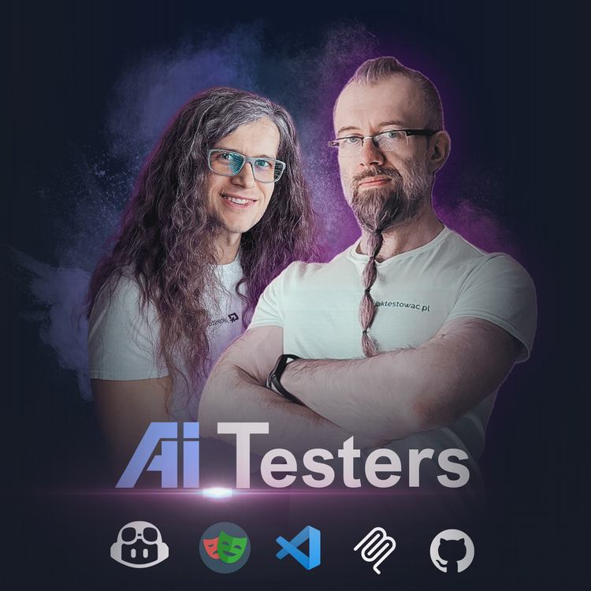

# 🤖 Awesome GitHub Copilot for Testers

To repozytorium jest kolekcją zasobów (promptów, instrukcji i trybów czatu) do wykorzystania z GitHub Copilotem, specjalnie dostosowanych do potrzeb testerów i automatyzacji testów.

Zasoby te pomogą Ci dostosować Copilota do Twoich specyficznych potrzeb, wytycznych zespołu i wymagań projektu.

> [!TIP]
> 💡 Wybierz swój język:
>
> - 🇬🇧 [English](./README.md)
> - 🇵🇱 [Polski](./README.pl.md)

> [!TIP]
> Ten projekt jest mocno inspirowany [Awesome GitHub Copilot](https://github.com/github/awesome-copilot) - starannie dobraną listą zasobów do efektywnego wykorzystania GitHub Copilota.
> Dostosowaliśmy strukturę i zawartość, aby skupić się konkretnie na testowaniu i inżynierii jakości, dostarczając dostosowane zasoby dla tej dziedziny.

Spis Treści

- [🎯 Funkcje Dostosowywania GitHub Copilota](#-funkcje-dostosowywania-github-copilota)
  - [📋 Zasoby](#-zasoby)
    - [Niestandardowe Instrukcje](#niestandardowe-instrukcje)
    - [Szablony Promptów](#szablony-promptów)
    - [Niestandardowe Tryby Czatu](#niestandardowe-tryby-czatu)
    - [Niestandardowe Agenty (Custom Agents)](#niestandardowe-agenty-custom-agents)
    - [Orkiestracja Agentów (Agent Orchestration)](#orkiestracja-agentów-agent-orchestration)
    - [Niestandardowe Zestawy (Custom Sets)](#niestandardowe-zestawy-custom-sets)
    - [Umiejętności Agentów (Agent Skills)](#umiejętności-agentów-agent-skills)
    - [Hooks](#hooks)
  - [📚 Dodatkowe Zasoby](#-dodatkowe-zasoby)
  - [🌱 Twórz z nami](#-twórz-z-nami)
  - [📞 Kontakt i Wsparcie](#-kontakt-i-wsparcie)
- [📚 Zasoby Edukacyjne](#-zasoby-edukacyjne)
  - [🇵🇱 Polskie Zasoby](#-polskie-zasoby)
  - [🇬🇧 Angielskie Zasoby](#-angielskie-zasoby)

> [!IMPORTANT]
> Sprawdź nasze darmowe nagranie na YouTube, aby dowiedzieć się więcej o GitHub Copilot Chat Modes:
>
> [](https://www.youtube.com/watch?v=hHrOJlk6ET8&list=PLfKhn9AcZ-cCqD34AG5YRejujaBqCBgl4)

## 🎯 Funkcje Dostosowywania GitHub Copilota

GitHub Copilot zapewnia trzy główne sposoby dostosowywania odpowiedzi AI:

- **Custom Instructions**: Zdefiniuj, jak Copilot ma się zachowywać, co priorytetować i jak komunikować.
- **Chat Modes**: Twórz specjalistyczne tryby czatu dla różnych ról lub zadań, każdy z własnym zestawem narzędzi i instrukcji. Z wersją [1.106](https://code.visualstudio.com/updates/v1_106) VS Code, Tryby Czatu zostały przemianowane na **Custom Agents**.
- **Custom Agents**: Zaawansowane tryby czatu, które mogą wykorzystywać wiele instrukcji i narzędzi do wykonywania złożonych zadań.
- **Prompt Templates**: Wstępnie zdefiniowane szablony dla typowych zadań lub pytań, umożliwiające szybkie i spójne odpowiedzi.

> [!TIP]
> Więcej możesz dowiedzieć się o tych funkcjach w [oficjalnej dokumentacji](https://code.visualstudio.com/docs/copilot/overview) oraz:
>
> - [Dokumentacja Dostosowywania Copilota w VS Code](https://code.visualstudio.com/docs/copilot/copilot-customization) - Oficjalna dokumentacja Microsoft
> - [Niestandardowe Tryby Czatu](https://code.visualstudio.com/docs/copilot/chat/chat-modes) - Zaawansowana konfiguracja czatu
> - [Niestandardowe Instrukcje](https://code.visualstudio.com/docs/copilot/customization/custom-instructions) - Tworzenie własnych instrukcji
> - [Prompt Files](https://code.visualstudio.com/docs/copilot/customization/prompt-files) - Tworzenie i używanie plików promptów
> - [Niestandardowe Agenty (Custom Agents)](https://code.visualstudio.com/docs/copilot/customization/custom-agents) - Zaawansowana konfiguracja agentów
> - [Agent Skills](https://code.visualstudio.com/docs/copilot/customization/agent-skills) - Rozszerzanie możliwości agentów za pomocą różnych umiejętności
> - [Używanie agentów w Visual Studio Code](https://code.visualstudio.com/docs/copilot/agents/overview) - Przegląd agentów i orkiestracji
> - [Subagenty w Visual Studio Code](https://code.visualstudio.com/docs/copilot/agents/subagents) - Używanie subagentów do specjalistycznych zadań

> [!TIP]
> Chcesz dowiedzieć się więcej o efektywnym wykorzystaniu AI i GitHub Copilota dla Testerów?
>
> Sprawdź nasz program [AI_Testers](https://aitesters.pl) - kompleksowy program opanowania AI w automatyzacji testów!
>
> <div align="center"><a href="https://aitesters.pl"></a></div>

## 📋 Zasoby

### Niestandardowe Instrukcje

> [!TIP]
> Użycie:
>
> - skopiuj te instrukcje do swojego pliku `.github/copilot-instructions.md` lub
> - utwórz specyficzne dla zadań pliki `.github/.instructions.md` w folderze `.github/instructions` swojego workspace
> - użyj komendy `Chat: Attach Instructions` z palety komend, aby zastosować je w bieżącym czacie

<!-- START_CUSTOM_INSTRUCTIONS -->

| Title | Description | Install |
| ----- | ----------- | ------- |
| [🤖 Copilot Instructions – Best Practices Guide](instructions/README.md) | Guide specific coding standards and best practices | [](https://vscode.dev/redirect?url=vscode%3Achat-instructions%2Finstall%3Furl%3Dhttps%3A%2F%2Fraw.githubusercontent.com%2Fjaktestowac%2Fawesome-copilot-for-testers%2Fmain%2Finstructions%2FREADME.md) [](https://insiders.vscode.dev/redirect?url=vscode-insiders%3Achat-instructions%2Finstall%3Furl%3Dhttps%3A%2F%2Fraw.githubusercontent.com%2Fjaktestowac%2Fawesome-copilot-for-testers%2Fmain%2Finstructions%2FREADME.md) |
| [API test rules (Playwright + TypeScript)](instructions/api-playwright-tests.instructions.md) | This file describes the API test rules for Playwright + TypeScript tests. | [](https://vscode.dev/redirect?url=vscode%3Achat-instructions%2Finstall%3Furl%3Dhttps%3A%2F%2Fraw.githubusercontent.com%2Fjaktestowac%2Fawesome-copilot-for-testers%2Fmain%2Finstructions%2Fapi-playwright-tests.instructions.md) [](https://insiders.vscode.dev/redirect?url=vscode-insiders%3Achat-instructions%2Finstall%3Furl%3Dhttps%3A%2F%2Fraw.githubusercontent.com%2Fjaktestowac%2Fawesome-copilot-for-testers%2Fmain%2Finstructions%2Fapi-playwright-tests.instructions.md) |
| [Playwright E2E rules](instructions/e2e-playwright.instructions.md) | This file describes the Playwright E2E test rules for Playwright + TypeScript tests. | [](https://vscode.dev/redirect?url=vscode%3Achat-instructions%2Finstall%3Furl%3Dhttps%3A%2F%2Fraw.githubusercontent.com%2Fjaktestowac%2Fawesome-copilot-for-testers%2Fmain%2Finstructions%2Fe2e-playwright.instructions.md) [](https://insiders.vscode.dev/redirect?url=vscode-insiders%3Achat-instructions%2Finstall%3Furl%3Dhttps%3A%2F%2Fraw.githubusercontent.com%2Fjaktestowac%2Fawesome-copilot-for-testers%2Fmain%2Finstructions%2Fe2e-playwright.instructions.md) |
| [Page Objects / App Actions rules (Playwright + TS)](instructions/page-objects.instructions.md) | This file describes the Page Object / App Action rules for Playwright + TypeScript tests. | [](https://vscode.dev/redirect?url=vscode%3Achat-instructions%2Finstall%3Furl%3Dhttps%3A%2F%2Fraw.githubusercontent.com%2Fjaktestowac%2Fawesome-copilot-for-testers%2Fmain%2Finstructions%2Fpage-objects.instructions.md) [](https://insiders.vscode.dev/redirect?url=vscode-insiders%3Achat-instructions%2Finstall%3Furl%3Dhttps%3A%2F%2Fraw.githubusercontent.com%2Fjaktestowac%2Fawesome-copilot-for-testers%2Fmain%2Finstructions%2Fpage-objects.instructions.md) |
| [Playwright TypeScript Test Generation Instructions](instructions/playwright-typescript.instructions.md) | Playwright test generation instructions with best practices and patterns. | [](https://vscode.dev/redirect?url=vscode%3Achat-instructions%2Finstall%3Furl%3Dhttps%3A%2F%2Fraw.githubusercontent.com%2Fjaktestowac%2Fawesome-copilot-for-testers%2Fmain%2Finstructions%2Fplaywright-typescript.instructions.md) [](https://insiders.vscode.dev/redirect?url=vscode-insiders%3Achat-instructions%2Finstall%3Furl%3Dhttps%3A%2F%2Fraw.githubusercontent.com%2Fjaktestowac%2Fawesome-copilot-for-testers%2Fmain%2Finstructions%2Fplaywright-typescript.instructions.md) |
| [TypeScript style rules](instructions/typescript-style.instructions.md) | This file describes the TypeScript code style for the project. | [](https://vscode.dev/redirect?url=vscode%3Achat-instructions%2Finstall%3Furl%3Dhttps%3A%2F%2Fraw.githubusercontent.com%2Fjaktestowac%2Fawesome-copilot-for-testers%2Fmain%2Finstructions%2Ftypescript-style.instructions.md) [](https://insiders.vscode.dev/redirect?url=vscode-insiders%3Achat-instructions%2Finstall%3Furl%3Dhttps%3A%2F%2Fraw.githubusercontent.com%2Fjaktestowac%2Fawesome-copilot-for-testers%2Fmain%2Finstructions%2Ftypescript-style.instructions.md) |

<!-- END_CUSTOM_INSTRUCTIONS -->

### Szablony Promptów

> [!TIP]
> Użycie:
>
> - skopiuj te prompty do swojego folderu `.github/copilot-prompts/`
> - użyj `/prompt-name` w czacie VS Code,
> - uruchom komendę `Chat: Run Prompt` z palety komend

<!-- START_CUSTOM_PROMPT_TEMPLATES -->

| Title | Description | Install |
| ----- | ----------- | ------- |
| [Accessibility audit — deep dive](prompts/a11y-audit-deep-dive.prompt.md) | Run a deeper accessibility audit for a page, sampled set of pages, or user flow with WCAG 2.2 mapping, manual verification guidance, and technical or stakeholder-ready output. | [](https://vscode.dev/redirect?url=vscode%3Achat-prompt%2Finstall%3Furl%3Dhttps%3A%2F%2Fraw.githubusercontent.com%2Fjaktestowac%2Fawesome-copilot-for-testers%2Fmain%2Fprompts%2Fa11y-audit-deep-dive.prompt.md) [](https://insiders.vscode.dev/redirect?url=vscode-insiders%3Achat-prompt%2Finstall%3Furl%3Dhttps%3A%2F%2Fraw.githubusercontent.com%2Fjaktestowac%2Fawesome-copilot-for-testers%2Fmain%2Fprompts%2Fa11y-audit-deep-dive.prompt.md) |
| [A11Y Webpage Audit (Single URL)](prompts/a11y-webpage-audit.prompt.md) | Analyze one webpage for accessibility with WCAG 2.1/2.2 mapping and actionable fixes. | [](https://vscode.dev/redirect?url=vscode%3Achat-prompt%2Finstall%3Furl%3Dhttps%3A%2F%2Fraw.githubusercontent.com%2Fjaktestowac%2Fawesome-copilot-for-testers%2Fmain%2Fprompts%2Fa11y-webpage-audit.prompt.md) [](https://insiders.vscode.dev/redirect?url=vscode-insiders%3Achat-prompt%2Finstall%3Furl%3Dhttps%3A%2F%2Fraw.githubusercontent.com%2Fjaktestowac%2Fawesome-copilot-for-testers%2Fmain%2Fprompts%2Fa11y-webpage-audit.prompt.md) |
| [API Test Plan & Test Generator](prompts/api-test-plan-and-tests.prompt.md) | Create a risk-based API test plan and generate example automated tests from API definitions (OpenAPI/Postman/custom docs). | [](https://vscode.dev/redirect?url=vscode%3Achat-prompt%2Finstall%3Furl%3Dhttps%3A%2F%2Fraw.githubusercontent.com%2Fjaktestowac%2Fawesome-copilot-for-testers%2Fmain%2Fprompts%2Fapi-test-plan-and-tests.prompt.md) [](https://insiders.vscode.dev/redirect?url=vscode-insiders%3Achat-prompt%2Finstall%3Furl%3Dhttps%3A%2F%2Fraw.githubusercontent.com%2Fjaktestowac%2Fawesome-copilot-for-testers%2Fmain%2Fprompts%2Fapi-test-plan-and-tests.prompt.md) |
| [Create a bug report](prompts/bug-report.prompt.md) | Turn rough tester notes, screenshots, logs, or observed behavior into a professional bug report with severity, reproducibility, and evidence guidance. | [](https://vscode.dev/redirect?url=vscode%3Achat-prompt%2Finstall%3Furl%3Dhttps%3A%2F%2Fraw.githubusercontent.com%2Fjaktestowac%2Fawesome-copilot-for-testers%2Fmain%2Fprompts%2Fbug-report.prompt.md) [](https://insiders.vscode.dev/redirect?url=vscode-insiders%3Achat-prompt%2Finstall%3Furl%3Dhttps%3A%2F%2Fraw.githubusercontent.com%2Fjaktestowac%2Fawesome-copilot-for-testers%2Fmain%2Fprompts%2Fbug-report.prompt.md) |
| [Create Skill](prompts/create-skill.prompt.md) | Create a new skill (SKILL.md) for VS Code Copilot. Analyzes existing skills for patterns, guides through design decisions, creates the skill file with supporting resources, and validates against best practices. | [](https://vscode.dev/redirect?url=vscode%3Achat-prompt%2Finstall%3Furl%3Dhttps%3A%2F%2Fraw.githubusercontent.com%2Fjaktestowac%2Fawesome-copilot-for-testers%2Fmain%2Fprompts%2Fcreate-skill.prompt.md) [](https://insiders.vscode.dev/redirect?url=vscode-insiders%3Achat-prompt%2Finstall%3Furl%3Dhttps%3A%2F%2Fraw.githubusercontent.com%2Fjaktestowac%2Fawesome-copilot-for-testers%2Fmain%2Fprompts%2Fcreate-skill.prompt.md) |
| [Analyze and explain code](prompts/explain-code.prompt.md) | Analysis of the code you provide, select, or open | [](https://vscode.dev/redirect?url=vscode%3Achat-prompt%2Finstall%3Furl%3Dhttps%3A%2F%2Fraw.githubusercontent.com%2Fjaktestowac%2Fawesome-copilot-for-testers%2Fmain%2Fprompts%2Fexplain-code.prompt.md) [](https://insiders.vscode.dev/redirect?url=vscode-insiders%3Achat-prompt%2Finstall%3Furl%3Dhttps%3A%2F%2Fraw.githubusercontent.com%2Fjaktestowac%2Fawesome-copilot-for-testers%2Fmain%2Fprompts%2Fexplain-code.prompt.md) |
| [Fix failing tests](prompts/fix-tests.prompt.md) | Fix failing tests in the codebase | [](https://vscode.dev/redirect?url=vscode%3Achat-prompt%2Finstall%3Furl%3Dhttps%3A%2F%2Fraw.githubusercontent.com%2Fjaktestowac%2Fawesome-copilot-for-testers%2Fmain%2Fprompts%2Ffix-tests.prompt.md) [](https://insiders.vscode.dev/redirect?url=vscode-insiders%3Achat-prompt%2Finstall%3Furl%3Dhttps%3A%2F%2Fraw.githubusercontent.com%2Fjaktestowac%2Fawesome-copilot-for-testers%2Fmain%2Fprompts%2Ffix-tests.prompt.md) |
| [Generate test data](prompts/generate-test-data.prompt.md) | Design realistic and edge-covering test data packs from requirements, constraints, or existing test plans for manual and automated testing. | [](https://vscode.dev/redirect?url=vscode%3Achat-prompt%2Finstall%3Furl%3Dhttps%3A%2F%2Fraw.githubusercontent.com%2Fjaktestowac%2Fawesome-copilot-for-testers%2Fmain%2Fprompts%2Fgenerate-test-data.prompt.md) [](https://insiders.vscode.dev/redirect?url=vscode-insiders%3Achat-prompt%2Finstall%3Furl%3Dhttps%3A%2F%2Fraw.githubusercontent.com%2Fjaktestowac%2Fawesome-copilot-for-testers%2Fmain%2Fprompts%2Fgenerate-test-data.prompt.md) |
| [Generate manual test cases](prompts/manual-test-cases.prompt.md) | Turn a feature description, acceptance criteria, exploratory notes, or a test plan into detailed manual test cases with risk tags, expected results, and automation hints. | [](https://vscode.dev/redirect?url=vscode%3Achat-prompt%2Finstall%3Furl%3Dhttps%3A%2F%2Fraw.githubusercontent.com%2Fjaktestowac%2Fawesome-copilot-for-testers%2Fmain%2Fprompts%2Fmanual-test-cases.prompt.md) [](https://insiders.vscode.dev/redirect?url=vscode-insiders%3Achat-prompt%2Finstall%3Furl%3Dhttps%3A%2F%2Fraw.githubusercontent.com%2Fjaktestowac%2Fawesome-copilot-for-testers%2Fmain%2Fprompts%2Fmanual-test-cases.prompt.md) |
| [Performance & Reliability Test Planner](prompts/performance-reliability-plan.prompt.md) | Design a performance and reliability test strategy and propose concrete load/soak tests for critical user flows. | [](https://vscode.dev/redirect?url=vscode%3Achat-prompt%2Finstall%3Furl%3Dhttps%3A%2F%2Fraw.githubusercontent.com%2Fjaktestowac%2Fawesome-copilot-for-testers%2Fmain%2Fprompts%2Fperformance-reliability-plan.prompt.md) [](https://insiders.vscode.dev/redirect?url=vscode-insiders%3Achat-prompt%2Finstall%3Furl%3Dhttps%3A%2F%2Fraw.githubusercontent.com%2Fjaktestowac%2Fawesome-copilot-for-testers%2Fmain%2Fprompts%2Fperformance-reliability-plan.prompt.md) |
| [Explore a website and gather network requests using Playwright MCP](prompts/playwright-explore-website-requests.prompt.md) | Website exploration and network request gathering using Playwright MCP | [](https://vscode.dev/redirect?url=vscode%3Achat-prompt%2Finstall%3Furl%3Dhttps%3A%2F%2Fraw.githubusercontent.com%2Fjaktestowac%2Fawesome-copilot-for-testers%2Fmain%2Fprompts%2Fplaywright-explore-website-requests.prompt.md) [](https://insiders.vscode.dev/redirect?url=vscode-insiders%3Achat-prompt%2Finstall%3Furl%3Dhttps%3A%2F%2Fraw.githubusercontent.com%2Fjaktestowac%2Fawesome-copilot-for-testers%2Fmain%2Fprompts%2Fplaywright-explore-website-requests.prompt.md) |
| [Explore a website and propose test cases](prompts/playwright-explore-website.prompt.md) | Website exploration using Playwright MCP | [](https://vscode.dev/redirect?url=vscode%3Achat-prompt%2Finstall%3Furl%3Dhttps%3A%2F%2Fraw.githubusercontent.com%2Fjaktestowac%2Fawesome-copilot-for-testers%2Fmain%2Fprompts%2Fplaywright-explore-website.prompt.md) [](https://insiders.vscode.dev/redirect?url=vscode-insiders%3Achat-prompt%2Finstall%3Furl%3Dhttps%3A%2F%2Fraw.githubusercontent.com%2Fjaktestowac%2Fawesome-copilot-for-testers%2Fmain%2Fprompts%2Fplaywright-explore-website.prompt.md) |
| [Generate tests based on a scenario using Playwright MCP](prompts/playwright-generate-test.prompt.md) | Generate a Playwright test based on a scenario using Playwright MCP | [](https://vscode.dev/redirect?url=vscode%3Achat-prompt%2Finstall%3Furl%3Dhttps%3A%2F%2Fraw.githubusercontent.com%2Fjaktestowac%2Fawesome-copilot-for-testers%2Fmain%2Fprompts%2Fplaywright-generate-test.prompt.md) [](https://insiders.vscode.dev/redirect?url=vscode-insiders%3Achat-prompt%2Finstall%3Furl%3Dhttps%3A%2F%2Fraw.githubusercontent.com%2Fjaktestowac%2Fawesome-copilot-for-testers%2Fmain%2Fprompts%2Fplaywright-generate-test.prompt.md) |
| [QA Strategy — Edge Cases, Security & Attack Scenarios](prompts/qa-strategy.prompt.md) | For any feature, user story, or API spec: instantly generate a structured scenario matrix covering edge cases, boundary values, OWASP Top 10 security attacks, and adversarial sequences. Use the qa-strategist agent mode for best results. | [](https://vscode.dev/redirect?url=vscode%3Achat-prompt%2Finstall%3Furl%3Dhttps%3A%2F%2Fraw.githubusercontent.com%2Fjaktestowac%2Fawesome-copilot-for-testers%2Fmain%2Fprompts%2Fqa-strategy.prompt.md) [](https://insiders.vscode.dev/redirect?url=vscode-insiders%3Achat-prompt%2Finstall%3Furl%3Dhttps%3A%2F%2Fraw.githubusercontent.com%2Fjaktestowac%2Fawesome-copilot-for-testers%2Fmain%2Fprompts%2Fqa-strategy.prompt.md) |
| [Analyze regression scope](prompts/regression-scope.prompt.md) | Turn a diff, PR summary, changed files, or hotfix description into a prioritized regression scope with a minimal confidence suite and retest guidance. | [](https://vscode.dev/redirect?url=vscode%3Achat-prompt%2Finstall%3Furl%3Dhttps%3A%2F%2Fraw.githubusercontent.com%2Fjaktestowac%2Fawesome-copilot-for-testers%2Fmain%2Fprompts%2Fregression-scope.prompt.md) [](https://insiders.vscode.dev/redirect?url=vscode-insiders%3Achat-prompt%2Finstall%3Furl%3Dhttps%3A%2F%2Fraw.githubusercontent.com%2Fjaktestowac%2Fawesome-copilot-for-testers%2Fmain%2Fprompts%2Fregression-scope.prompt.md) |
| [Tech Debt Audit — Test Automation Code Review](prompts/tech-debt-audit.prompt.md) | Ruthlessly audit automated test code for anti-patterns: fragile selectors, hardcoded waits, missing assertions, test interdependencies, credential leaks, and more. Produces a severity-ranked debt report with line-level citations and concrete fixes. Use the tech-debt-auditor agent mode for best results. | [](https://vscode.dev/redirect?url=vscode%3Achat-prompt%2Finstall%3Furl%3Dhttps%3A%2F%2Fraw.githubusercontent.com%2Fjaktestowac%2Fawesome-copilot-for-testers%2Fmain%2Fprompts%2Ftech-debt-audit.prompt.md) [](https://insiders.vscode.dev/redirect?url=vscode-insiders%3Achat-prompt%2Finstall%3Furl%3Dhttps%3A%2F%2Fraw.githubusercontent.com%2Fjaktestowac%2Fawesome-copilot-for-testers%2Fmain%2Fprompts%2Ftech-debt-audit.prompt.md) |
| [Generate tests based on test plan](prompts/test-generator.prompt.md) | Generate tests based on test plan for a website | [](https://vscode.dev/redirect?url=vscode%3Achat-prompt%2Finstall%3Furl%3Dhttps%3A%2F%2Fraw.githubusercontent.com%2Fjaktestowac%2Fawesome-copilot-for-testers%2Fmain%2Fprompts%2Ftest-generator.prompt.md) [](https://insiders.vscode.dev/redirect?url=vscode-insiders%3Achat-prompt%2Finstall%3Furl%3Dhttps%3A%2F%2Fraw.githubusercontent.com%2Fjaktestowac%2Fawesome-copilot-for-testers%2Fmain%2Fprompts%2Ftest-generator.prompt.md) |
| [Generate a Basic Test Plan](prompts/test-plan-basic.prompt.md) | Generate a basic Test Plan | [](https://vscode.dev/redirect?url=vscode%3Achat-prompt%2Finstall%3Furl%3Dhttps%3A%2F%2Fraw.githubusercontent.com%2Fjaktestowac%2Fawesome-copilot-for-testers%2Fmain%2Fprompts%2Ftest-plan-basic.prompt.md) [](https://insiders.vscode.dev/redirect?url=vscode-insiders%3Achat-prompt%2Finstall%3Furl%3Dhttps%3A%2F%2Fraw.githubusercontent.com%2Fjaktestowac%2Fawesome-copilot-for-testers%2Fmain%2Fprompts%2Ftest-plan-basic.prompt.md) |
| [Generate a comprehensive Test Plan](prompts/test-planner.prompt.md) | Collects environment details and produces a prioritized test plan with web and API scenarios using the `Test Planner Chat Mode`. | [](https://vscode.dev/redirect?url=vscode%3Achat-prompt%2Finstall%3Furl%3Dhttps%3A%2F%2Fraw.githubusercontent.com%2Fjaktestowac%2Fawesome-copilot-for-testers%2Fmain%2Fprompts%2Ftest-planner.prompt.md) [](https://insiders.vscode.dev/redirect?url=vscode-insiders%3Achat-prompt%2Finstall%3Furl%3Dhttps%3A%2F%2Fraw.githubusercontent.com%2Fjaktestowac%2Fawesome-copilot-for-testers%2Fmain%2Fprompts%2Ftest-planner.prompt.md) |
| [Verify acceptance criteria](prompts/verify-acceptance-criteria.prompt.md) | Compare implementation evidence against acceptance criteria and show what is met, partial, missing, or still untestable. | [](https://vscode.dev/redirect?url=vscode%3Achat-prompt%2Finstall%3Furl%3Dhttps%3A%2F%2Fraw.githubusercontent.com%2Fjaktestowac%2Fawesome-copilot-for-testers%2Fmain%2Fprompts%2Fverify-acceptance-criteria.prompt.md) [](https://insiders.vscode.dev/redirect?url=vscode-insiders%3Achat-prompt%2Finstall%3Furl%3Dhttps%3A%2F%2Fraw.githubusercontent.com%2Fjaktestowac%2Fawesome-copilot-for-testers%2Fmain%2Fprompts%2Fverify-acceptance-criteria.prompt.md) |

<!-- END_CUSTOM_PROMPT_TEMPLATES -->

### Niestandardowe Tryby Czatu

> [!TIP]
> Użycie (w VS Code przed wersją 1.106):
>
> - utwórz nowe tryby czatu:
>   - używając komendy `Chat: Configure Chat Modes...` lub
>   - z menu ustawień trybu `Agent -> Configure Modes`,
> - następnie przełącz swój tryb czatu w wejściu Chat z menu ustawień trybu `Agent -> Configure Modes`

> [!WARNING]
> Z wersją [1.106](https://code.visualstudio.com/updates/v1_106) VS Code, Tryby Czatu zostały przemianowane na **Niestandardowe Agenty** (Custom Agents).
> Zawierają one sufiks `.agent.md` i powinny być przechowywane w `.github/agents/`

<!-- START_CUSTOM_CHAT_MODES -->

| Title | Description | Install |
| ----- | ----------- | ------- |
| [Accessibility Expert mode](chatmodes/accesibility.chatmode.md) | A specialized chat mode focused on ensuring all code adheres to WCAG 2.1 accessibility standards. | [](https://vscode.dev/redirect?url=vscode%3Achat-mode%2Finstall%3Furl%3Dhttps%3A%2F%2Fraw.githubusercontent.com%2Fjaktestowac%2Fawesome-copilot-for-testers%2Fmain%2Fchatmodes%2Faccesibility.chatmode.md) [](https://insiders.vscode.dev/redirect?url=vscode-insiders%3Achat-mode%2Finstall%3Furl%3Dhttps%3A%2F%2Fraw.githubusercontent.com%2Fjaktestowac%2Fawesome-copilot-for-testers%2Fmain%2Fchatmodes%2Faccesibility.chatmode.md) |
| [Playwright Automation Engineer (TypeScript) mode (detailed)](chatmodes/playwright-expert-detailed.chatmode.md) | Provide expert guidance, code, and troubleshooting help for end-to-end and component-level test automation using Playwright with TypeScript. Prioritize maintainability, speed, reliability, and business value of the test suite. Very detailed operating manual. | [](https://vscode.dev/redirect?url=vscode%3Achat-mode%2Finstall%3Furl%3Dhttps%3A%2F%2Fraw.githubusercontent.com%2Fjaktestowac%2Fawesome-copilot-for-testers%2Fmain%2Fchatmodes%2Fplaywright-expert-detailed.chatmode.md) [](https://insiders.vscode.dev/redirect?url=vscode-insiders%3Achat-mode%2Finstall%3Furl%3Dhttps%3A%2F%2Fraw.githubusercontent.com%2Fjaktestowac%2Fawesome-copilot-for-testers%2Fmain%2Fchatmodes%2Fplaywright-expert-detailed.chatmode.md) |
| [Playwright Automation Engineer (TypeScript) mode](chatmodes/playwright-expert.chatmode.md) | Provide expert guidance, code, and troubleshooting help for end-to-end and component-level test automation using Playwright with TypeScript. Prioritize maintainability, speed, reliability, and business value of the test suite. | [](https://vscode.dev/redirect?url=vscode%3Achat-mode%2Finstall%3Furl%3Dhttps%3A%2F%2Fraw.githubusercontent.com%2Fjaktestowac%2Fawesome-copilot-for-testers%2Fmain%2Fchatmodes%2Fplaywright-expert.chatmode.md) [](https://insiders.vscode.dev/redirect?url=vscode-insiders%3Achat-mode%2Finstall%3Furl%3Dhttps%3A%2F%2Fraw.githubusercontent.com%2Fjaktestowac%2Fawesome-copilot-for-testers%2Fmain%2Fchatmodes%2Fplaywright-expert.chatmode.md) |
| [QA Strategist — Edge Cases, Security & Attacks](chatmodes/qa-strategist.chatmode.md) | Kills happy-path thinking. For every feature, spec, or user story the agent immediately surfaces edge cases, boundary values, security attacks (OWASP Top 10), and adversarial scenarios before a single line of test code is written. | [](https://vscode.dev/redirect?url=vscode%3Achat-mode%2Finstall%3Furl%3Dhttps%3A%2F%2Fraw.githubusercontent.com%2Fjaktestowac%2Fawesome-copilot-for-testers%2Fmain%2Fchatmodes%2Fqa-strategist.chatmode.md) [](https://insiders.vscode.dev/redirect?url=vscode-insiders%3Achat-mode%2Finstall%3Furl%3Dhttps%3A%2F%2Fraw.githubusercontent.com%2Fjaktestowac%2Fawesome-copilot-for-testers%2Fmain%2Fchatmodes%2Fqa-strategist.chatmode.md) |
| [Tech Debt Auditor — Test Automation Code Reviewer](chatmodes/tech-debt-auditor.chatmode.md) | A ruthless, opinionated code reviewer for automated test suites. Hunts down anti-patterns, tech debt, and bad practices — from fragile selectors and hardcoded waits to test interdependencies, weak assertions, and credential leaks. | [](https://vscode.dev/redirect?url=vscode%3Achat-mode%2Finstall%3Furl%3Dhttps%3A%2F%2Fraw.githubusercontent.com%2Fjaktestowac%2Fawesome-copilot-for-testers%2Fmain%2Fchatmodes%2Ftech-debt-auditor.chatmode.md) [](https://insiders.vscode.dev/redirect?url=vscode-insiders%3Achat-mode%2Finstall%3Furl%3Dhttps%3A%2F%2Fraw.githubusercontent.com%2Fjaktestowac%2Fawesome-copilot-for-testers%2Fmain%2Fchatmodes%2Ftech-debt-auditor.chatmode.md) |
| [Test Automation Architect](chatmodes/test-automation-expert.chatmode.md) | Help engineers craft robust, fast, and maintainable automated tests that deliver actionable feedback and integrate seamlessly into modern SDLC pipelines. | [](https://vscode.dev/redirect?url=vscode%3Achat-mode%2Finstall%3Furl%3Dhttps%3A%2F%2Fraw.githubusercontent.com%2Fjaktestowac%2Fawesome-copilot-for-testers%2Fmain%2Fchatmodes%2Ftest-automation-expert.chatmode.md) [](https://insiders.vscode.dev/redirect?url=vscode-insiders%3Achat-mode%2Finstall%3Furl%3Dhttps%3A%2F%2Fraw.githubusercontent.com%2Fjaktestowac%2Fawesome-copilot-for-testers%2Fmain%2Fchatmodes%2Ftest-automation-expert.chatmode.md) |
| [Test plan from expert Senior Quality Assurance Engineer](chatmodes/test-planner.chatmode.md) | This chat mode is designed to assist in creating comprehensive test plans tailored for web applications. | [](https://vscode.dev/redirect?url=vscode%3Achat-mode%2Finstall%3Furl%3Dhttps%3A%2F%2Fraw.githubusercontent.com%2Fjaktestowac%2Fawesome-copilot-for-testers%2Fmain%2Fchatmodes%2Ftest-planner.chatmode.md) [](https://insiders.vscode.dev/redirect?url=vscode-insiders%3Achat-mode%2Finstall%3Furl%3Dhttps%3A%2F%2Fraw.githubusercontent.com%2Fjaktestowac%2Fawesome-copilot-for-testers%2Fmain%2Fchatmodes%2Ftest-planner.chatmode.md) |

<!-- END_CUSTOM_CHAT_MODES -->

### Niestandardowe Agenty (Custom Agents)

> [!TIP]
> Użycie (w VS Code od wersji 1.106):
>
> - utwórz nowe agenty czatu:
>   - używając komendy `Chat: Configure Custom Agents...` lub
>   - z menu ustawień trybu `Agent -> Configure Custom Agents`,
> - następnie przełącz swój tryb czatu w wejściu Chat z menu ustawień trybu `Agent -> <Your Agent>`

<!-- START_CUSTOM_AGENTS -->

| Title | Description | Install |
| ----- | ----------- | ------- |
| [Accessibility Expert mode](agents/accesibility.agent.md) | A specialized Agent focused on ensuring all code adheres to WCAG 2.1 accessibility standards. | [](https://vscode.dev/redirect?url=vscode%3Achat-agent%2Finstall%3Furl%3Dhttps%3A%2F%2Fraw.githubusercontent.com%2Fjaktestowac%2Fawesome-copilot-for-testers%2Fmain%2Fagents%2Faccesibility.agent.md) [](https://insiders.vscode.dev/redirect?url=vscode-insiders%3Achat-agent%2Finstall%3Furl%3Dhttps%3A%2F%2Fraw.githubusercontent.com%2Fjaktestowac%2Fawesome-copilot-for-testers%2Fmain%2Fagents%2Faccesibility.agent.md) |
| [API Test Automation (from OpenAPI spec)](agents/api-test-automation.agent.md) | description: Generate REST API tests from an OpenAPI spec (language/framework provided by the user). | [](https://vscode.dev/redirect?url=vscode%3Achat-agent%2Finstall%3Furl%3Dhttps%3A%2F%2Fraw.githubusercontent.com%2Fjaktestowac%2Fawesome-copilot-for-testers%2Fmain%2Fagents%2Fapi-test-automation.agent.md) [](https://insiders.vscode.dev/redirect?url=vscode-insiders%3Achat-agent%2Finstall%3Furl%3Dhttps%3A%2F%2Fraw.githubusercontent.com%2Fjaktestowac%2Fawesome-copilot-for-testers%2Fmain%2Fagents%2Fapi-test-automation.agent.md) |
| [Agent mission](agents/openapi-test-automation-expert.agent.md) | Generates and maintains automated tests from an OpenAPI schema and supports testers as a test automation expert (best practices, patterns, project tooling). | [](https://vscode.dev/redirect?url=vscode%3Achat-agent%2Finstall%3Furl%3Dhttps%3A%2F%2Fraw.githubusercontent.com%2Fjaktestowac%2Fawesome-copilot-for-testers%2Fmain%2Fagents%2Fopenapi-test-automation-expert.agent.md) [](https://insiders.vscode.dev/redirect?url=vscode-insiders%3Achat-agent%2Finstall%3Furl%3Dhttps%3A%2F%2Fraw.githubusercontent.com%2Fjaktestowac%2Fawesome-copilot-for-testers%2Fmain%2Fagents%2Fopenapi-test-automation-expert.agent.md) |
| [Playwright Automation Engineer (TypeScript) mode (detailed)](agents/playwright-expert-detailed.agent.md) | Provide expert guidance, code, and troubleshooting help for end-to-end and component-level test automation using Playwright with TypeScript. Prioritize maintainability, speed, reliability, and business value of the test suite. Very detailed operating manual. | [](https://vscode.dev/redirect?url=vscode%3Achat-agent%2Finstall%3Furl%3Dhttps%3A%2F%2Fraw.githubusercontent.com%2Fjaktestowac%2Fawesome-copilot-for-testers%2Fmain%2Fagents%2Fplaywright-expert-detailed.agent.md) [](https://insiders.vscode.dev/redirect?url=vscode-insiders%3Achat-agent%2Finstall%3Furl%3Dhttps%3A%2F%2Fraw.githubusercontent.com%2Fjaktestowac%2Fawesome-copilot-for-testers%2Fmain%2Fagents%2Fplaywright-expert-detailed.agent.md) |
| [Playwright Automation Engineer (TypeScript) mode](agents/playwright-expert.agent.md) | Provide expert guidance, code, and troubleshooting help for end-to-end and component-level test automation using Playwright with TypeScript. Prioritize maintainability, speed, reliability, and business value of the test suite. | [](https://vscode.dev/redirect?url=vscode%3Achat-agent%2Finstall%3Furl%3Dhttps%3A%2F%2Fraw.githubusercontent.com%2Fjaktestowac%2Fawesome-copilot-for-testers%2Fmain%2Fagents%2Fplaywright-expert.agent.md) [](https://insiders.vscode.dev/redirect?url=vscode-insiders%3Achat-agent%2Finstall%3Furl%3Dhttps%3A%2F%2Fraw.githubusercontent.com%2Fjaktestowac%2Fawesome-copilot-for-testers%2Fmain%2Fagents%2Fplaywright-expert.agent.md) |
| [QA Strategist — Edge Cases, Security & Attacks](agents/qa-strategist.agent.md) | Kills happy-path thinking. For every feature, spec, or user story the agent immediately surfaces edge cases, boundary values, security attacks (OWASP Top 10), and adversarial scenarios before a single line of test code is written. | [](https://vscode.dev/redirect?url=vscode%3Achat-agent%2Finstall%3Furl%3Dhttps%3A%2F%2Fraw.githubusercontent.com%2Fjaktestowac%2Fawesome-copilot-for-testers%2Fmain%2Fagents%2Fqa-strategist.agent.md) [](https://insiders.vscode.dev/redirect?url=vscode-insiders%3Achat-agent%2Finstall%3Furl%3Dhttps%3A%2F%2Fraw.githubusercontent.com%2Fjaktestowac%2Fawesome-copilot-for-testers%2Fmain%2Fagents%2Fqa-strategist.agent.md) |
| [🦆 Rubber Duck 2.0](agents/rubber-duck-2.0.agent.md) | Interactive debugging partner for QA and testers that uses Socratic questioning to help identify root causes without giving ready-made fixes. | [](https://vscode.dev/redirect?url=vscode%3Achat-agent%2Finstall%3Furl%3Dhttps%3A%2F%2Fraw.githubusercontent.com%2Fjaktestowac%2Fawesome-copilot-for-testers%2Fmain%2Fagents%2Frubber-duck-2.0.agent.md) [](https://insiders.vscode.dev/redirect?url=vscode-insiders%3Achat-agent%2Finstall%3Furl%3Dhttps%3A%2F%2Fraw.githubusercontent.com%2Fjaktestowac%2Fawesome-copilot-for-testers%2Fmain%2Fagents%2Frubber-duck-2.0.agent.md) |
| [Tech Debt Auditor](agents/tech-debt-auditor.agent.md) | Audits the repo for technical debt, quantifies impact/risk, and produces a prioritized remediation plan with small, safe PR-sized recommendations. | [](https://vscode.dev/redirect?url=vscode%3Achat-agent%2Finstall%3Furl%3Dhttps%3A%2F%2Fraw.githubusercontent.com%2Fjaktestowac%2Fawesome-copilot-for-testers%2Fmain%2Fagents%2Ftech-debt-auditor.agent.md) [](https://insiders.vscode.dev/redirect?url=vscode-insiders%3Achat-agent%2Finstall%3Furl%3Dhttps%3A%2F%2Fraw.githubusercontent.com%2Fjaktestowac%2Fawesome-copilot-for-testers%2Fmain%2Fagents%2Ftech-debt-auditor.agent.md) |
| [Test Automation Architect](agents/test-automation-expert.agent.md) | Help engineers craft robust, fast, and maintainable automated tests that deliver actionable feedback and integrate seamlessly into modern SDLC pipelines. | [](https://vscode.dev/redirect?url=vscode%3Achat-agent%2Finstall%3Furl%3Dhttps%3A%2F%2Fraw.githubusercontent.com%2Fjaktestowac%2Fawesome-copilot-for-testers%2Fmain%2Fagents%2Ftest-automation-expert.agent.md) [](https://insiders.vscode.dev/redirect?url=vscode-insiders%3Achat-agent%2Finstall%3Furl%3Dhttps%3A%2F%2Fraw.githubusercontent.com%2Fjaktestowac%2Fawesome-copilot-for-testers%2Fmain%2Fagents%2Ftest-automation-expert.agent.md) |
| [Test plan from expert Senior Quality Assurance Engineer](agents/test-planner.agent.md) | This chat mode is designed to assist in creating comprehensive test plans tailored for web applications. | [](https://vscode.dev/redirect?url=vscode%3Achat-agent%2Finstall%3Furl%3Dhttps%3A%2F%2Fraw.githubusercontent.com%2Fjaktestowac%2Fawesome-copilot-for-testers%2Fmain%2Fagents%2Ftest-planner.agent.md) [](https://insiders.vscode.dev/redirect?url=vscode-insiders%3Achat-agent%2Finstall%3Furl%3Dhttps%3A%2F%2Fraw.githubusercontent.com%2Fjaktestowac%2Fawesome-copilot-for-testers%2Fmain%2Fagents%2Ftest-planner.agent.md) |
| [Ui Test Automation](agents/ui-test-automation.agent.md) | This custom agent creates and maintains Playwright tests for UI automation. Used in courses from **[AI_Testers](https://aitesters.pl/)** (courses about test automation for UI and REST API with AI). | [](https://vscode.dev/redirect?url=vscode%3Achat-agent%2Finstall%3Furl%3Dhttps%3A%2F%2Fraw.githubusercontent.com%2Fjaktestowac%2Fawesome-copilot-for-testers%2Fmain%2Fagents%2Fui-test-automation.agent.md) [](https://insiders.vscode.dev/redirect?url=vscode-insiders%3Achat-agent%2Finstall%3Furl%3Dhttps%3A%2F%2Fraw.githubusercontent.com%2Fjaktestowac%2Fawesome-copilot-for-testers%2Fmain%2Fagents%2Fui-test-automation.agent.md) |

<!-- END_CUSTOM_AGENTS -->

### Orkiestracja Agentów (Agent Orchestration)

> [!TIP]
>
> Użycie (w VS Code od wersji 1.109):
> Wybierz zestaw agentów i zainstaluj agentów, których chcesz używać razem, a następnie przełącz się na głównego agenta w VS Code z zestawu i rozpocznij rozmowę. Agenci będą automatycznie wywoływać się nawzajem zgodnie z zdefiniowanym przepływem orkiestracji.
>
> Dokumentacja:
>
> - https://code.visualstudio.com/docs/copilot/agents/subagents
> - https://code.visualstudio.com/updates/v1_109#_control-how-custom-agents-are-invoked

<!-- START_CUSTOM_AGENT_ORCHESTRATION -->

#### **[Minimal Agent Orchestration Example](agent-orchestration/minimal-example/README.md)**

Contains 4 agents.

| Title | Description | Install |
| ----- | ----------- | ------- |
| [Analyst](agent-orchestration/minimal-example/Analyst-subagent.agent.md) | Analyst: pattern analysis, risk assessment, and insight generation | [](https://vscode.dev/redirect?url=vscode%3Achat-agent%2Finstall%3Furl%3Dhttps%3A%2F%2Fraw.githubusercontent.com%2Fjaktestowac%2Fawesome-copilot-for-testers%2Fmain%2Fagent-orchestration%2Fminimal-example%2FAnalyst-subagent.agent.md) [](https://insiders.vscode.dev/redirect?url=vscode-insiders%3Achat-agent%2Finstall%3Furl%3Dhttps%3A%2F%2Fraw.githubusercontent.com%2Fjaktestowac%2Fawesome-copilot-for-testers%2Fmain%2Fagent-orchestration%2Fminimal-example%2FAnalyst-subagent.agent.md) |
| [Explorer](agent-orchestration/minimal-example/Explorer-subagent.agent.md) | Explorer: fast read-only codebase mapping and pattern discovery | [](https://vscode.dev/redirect?url=vscode%3Achat-agent%2Finstall%3Furl%3Dhttps%3A%2F%2Fraw.githubusercontent.com%2Fjaktestowac%2Fawesome-copilot-for-testers%2Fmain%2Fagent-orchestration%2Fminimal-example%2FExplorer-subagent.agent.md) [](https://insiders.vscode.dev/redirect?url=vscode-insiders%3Achat-agent%2Finstall%3Furl%3Dhttps%3A%2F%2Fraw.githubusercontent.com%2Fjaktestowac%2Fawesome-copilot-for-testers%2Fmain%2Fagent-orchestration%2Fminimal-example%2FExplorer-subagent.agent.md) |
| [Orchestrator](agent-orchestration/minimal-example/Orchestrator.agent.md) | Orchestrator: multi-agent conductor with explicit stop gates | [](https://vscode.dev/redirect?url=vscode%3Achat-agent%2Finstall%3Furl%3Dhttps%3A%2F%2Fraw.githubusercontent.com%2Fjaktestowac%2Fawesome-copilot-for-testers%2Fmain%2Fagent-orchestration%2Fminimal-example%2FOrchestrator.agent.md) [](https://insiders.vscode.dev/redirect?url=vscode-insiders%3Achat-agent%2Finstall%3Furl%3Dhttps%3A%2F%2Fraw.githubusercontent.com%2Fjaktestowac%2Fawesome-copilot-for-testers%2Fmain%2Fagent-orchestration%2Fminimal-example%2FOrchestrator.agent.md) |
| [Planner](agent-orchestration/minimal-example/Planner-subagent.agent.md) | Planner: research-driven phased plan with test strategy and risks | [](https://vscode.dev/redirect?url=vscode%3Achat-agent%2Finstall%3Furl%3Dhttps%3A%2F%2Fraw.githubusercontent.com%2Fjaktestowac%2Fawesome-copilot-for-testers%2Fmain%2Fagent-orchestration%2Fminimal-example%2FPlanner-subagent.agent.md) [](https://insiders.vscode.dev/redirect?url=vscode-insiders%3Achat-agent%2Finstall%3Furl%3Dhttps%3A%2F%2Fraw.githubusercontent.com%2Fjaktestowac%2Fawesome-copilot-for-testers%2Fmain%2Fagent-orchestration%2Fminimal-example%2FPlanner-subagent.agent.md) |

#### **[VS Code Copilot Agents Pack (Architect + Test Architect)](agent-orchestration/plan-explore-review-commit/README.md)**

Contains 10 agents.

| Title | Description | Install |
| ----- | ----------- | ------- |
| [Architect Subagent](agent-orchestration/plan-explore-review-commit/Architect-subagent.agent.md) | Architect: ADR-ready trade-offs, NFR impacts, threat models, and test implications | [](https://vscode.dev/redirect?url=vscode%3Achat-agent%2Finstall%3Furl%3Dhttps%3A%2F%2Fraw.githubusercontent.com%2Fjaktestowac%2Fawesome-copilot-for-testers%2Fmain%2Fagent-orchestration%2Fplan-explore-review-commit%2FArchitect-subagent.agent.md) [](https://insiders.vscode.dev/redirect?url=vscode-insiders%3Achat-agent%2Finstall%3Furl%3Dhttps%3A%2F%2Fraw.githubusercontent.com%2Fjaktestowac%2Fawesome-copilot-for-testers%2Fmain%2Fagent-orchestration%2Fplan-explore-review-commit%2FArchitect-subagent.agent.md) |
| [Code Review Subagent](agent-orchestration/plan-explore-review-commit/Code-Review-subagent.agent.md) | Code review: correctness, risks, security, tests, and regressions (no fixes) | [](https://vscode.dev/redirect?url=vscode%3Achat-agent%2Finstall%3Furl%3Dhttps%3A%2F%2Fraw.githubusercontent.com%2Fjaktestowac%2Fawesome-copilot-for-testers%2Fmain%2Fagent-orchestration%2Fplan-explore-review-commit%2FCode-Review-subagent.agent.md) [](https://insiders.vscode.dev/redirect?url=vscode-insiders%3Achat-agent%2Finstall%3Furl%3Dhttps%3A%2F%2Fraw.githubusercontent.com%2Fjaktestowac%2Fawesome-copilot-for-testers%2Fmain%2Fagent-orchestration%2Fplan-explore-review-commit%2FCode-Review-subagent.agent.md) |
| [Docs Writer Subagent](agent-orchestration/plan-explore-review-commit/Docs-Writer-subagent.agent.md) | Docs: README updates, usage examples, API docs, and release notes – copy-paste ready | [](https://vscode.dev/redirect?url=vscode%3Achat-agent%2Finstall%3Furl%3Dhttps%3A%2F%2Fraw.githubusercontent.com%2Fjaktestowac%2Fawesome-copilot-for-testers%2Fmain%2Fagent-orchestration%2Fplan-explore-review-commit%2FDocs-Writer-subagent.agent.md) [](https://insiders.vscode.dev/redirect?url=vscode-insiders%3Achat-agent%2Finstall%3Furl%3Dhttps%3A%2F%2Fraw.githubusercontent.com%2Fjaktestowac%2Fawesome-copilot-for-testers%2Fmain%2Fagent-orchestration%2Fplan-explore-review-commit%2FDocs-Writer-subagent.agent.md) |
| [Explorer Subagent](agent-orchestration/plan-explore-review-commit/Explorer-subagent.agent.md) | Explorer: fast read-only map of files, usages, patterns, and entry points | [](https://vscode.dev/redirect?url=vscode%3Achat-agent%2Finstall%3Furl%3Dhttps%3A%2F%2Fraw.githubusercontent.com%2Fjaktestowac%2Fawesome-copilot-for-testers%2Fmain%2Fagent-orchestration%2Fplan-explore-review-commit%2FExplorer-subagent.agent.md) [](https://insiders.vscode.dev/redirect?url=vscode-insiders%3Achat-agent%2Finstall%3Furl%3Dhttps%3A%2F%2Fraw.githubusercontent.com%2Fjaktestowac%2Fawesome-copilot-for-testers%2Fmain%2Fagent-orchestration%2Fplan-explore-review-commit%2FExplorer-subagent.agent.md) |
| [Implementer Subagent](agent-orchestration/plan-explore-review-commit/Implementer-subagent.agent.md) | Implementer: TDD-first phase delivery with minimal diffs and quality gates | [](https://vscode.dev/redirect?url=vscode%3Achat-agent%2Finstall%3Furl%3Dhttps%3A%2F%2Fraw.githubusercontent.com%2Fjaktestowac%2Fawesome-copilot-for-testers%2Fmain%2Fagent-orchestration%2Fplan-explore-review-commit%2FImplementer-subagent.agent.md) [](https://insiders.vscode.dev/redirect?url=vscode-insiders%3Achat-agent%2Finstall%3Furl%3Dhttps%3A%2F%2Fraw.githubusercontent.com%2Fjaktestowac%2Fawesome-copilot-for-testers%2Fmain%2Fagent-orchestration%2Fplan-explore-review-commit%2FImplementer-subagent.agent.md) |
| [Orchestrator Agent](agent-orchestration/plan-explore-review-commit/Orchestrator.agent.md) | Orchestrator: multi-agent lifecycle with explicit stop gates | [](https://vscode.dev/redirect?url=vscode%3Achat-agent%2Finstall%3Furl%3Dhttps%3A%2F%2Fraw.githubusercontent.com%2Fjaktestowac%2Fawesome-copilot-for-testers%2Fmain%2Fagent-orchestration%2Fplan-explore-review-commit%2FOrchestrator.agent.md) [](https://insiders.vscode.dev/redirect?url=vscode-insiders%3Achat-agent%2Finstall%3Furl%3Dhttps%3A%2F%2Fraw.githubusercontent.com%2Fjaktestowac%2Fawesome-copilot-for-testers%2Fmain%2Fagent-orchestration%2Fplan-explore-review-commit%2FOrchestrator.agent.md) |
| [Planner Agent](agent-orchestration/plan-explore-review-commit/Planner.agent.md) | Planner: research-driven phased plan with tests and NFRs | [](https://vscode.dev/redirect?url=vscode%3Achat-agent%2Finstall%3Furl%3Dhttps%3A%2F%2Fraw.githubusercontent.com%2Fjaktestowac%2Fawesome-copilot-for-testers%2Fmain%2Fagent-orchestration%2Fplan-explore-review-commit%2FPlanner.agent.md) [](https://insiders.vscode.dev/redirect?url=vscode-insiders%3Achat-agent%2Finstall%3Furl%3Dhttps%3A%2F%2Fraw.githubusercontent.com%2Fjaktestowac%2Fawesome-copilot-for-testers%2Fmain%2Fagent-orchestration%2Fplan-explore-review-commit%2FPlanner.agent.md) |
| [QA Strategy Subagent](agent-orchestration/plan-explore-review-commit/QA-Strategy-subagent.agent.md) | QA strategy: test pyramid, coverage goals, quality gates, and flakiness mitigation | [](https://vscode.dev/redirect?url=vscode%3Achat-agent%2Finstall%3Furl%3Dhttps%3A%2F%2Fraw.githubusercontent.com%2Fjaktestowac%2Fawesome-copilot-for-testers%2Fmain%2Fagent-orchestration%2Fplan-explore-review-commit%2FQA-Strategy-subagent.agent.md) [](https://insiders.vscode.dev/redirect?url=vscode-insiders%3Achat-agent%2Finstall%3Furl%3Dhttps%3A%2F%2Fraw.githubusercontent.com%2Fjaktestowac%2Fawesome-copilot-for-testers%2Fmain%2Fagent-orchestration%2Fplan-explore-review-commit%2FQA-Strategy-subagent.agent.md) |
| [Researcher Subagent](agent-orchestration/plan-explore-review-commit/Researcher-subagent.agent.md) | Researcher: extract conventions, key files, patterns, and examples at scale | [](https://vscode.dev/redirect?url=vscode%3Achat-agent%2Finstall%3Furl%3Dhttps%3A%2F%2Fraw.githubusercontent.com%2Fjaktestowac%2Fawesome-copilot-for-testers%2Fmain%2Fagent-orchestration%2Fplan-explore-review-commit%2FResearcher-subagent.agent.md) [](https://insiders.vscode.dev/redirect?url=vscode-insiders%3Achat-agent%2Finstall%3Furl%3Dhttps%3A%2F%2Fraw.githubusercontent.com%2Fjaktestowac%2Fawesome-copilot-for-testers%2Fmain%2Fagent-orchestration%2Fplan-explore-review-commit%2FResearcher-subagent.agent.md) |
| [Security Auditor Subagent](agent-orchestration/plan-explore-review-commit/Security-Auditor-subagent.agent.md) | Security audit: threat model, risk scan, OWASP mapping, and concrete mitigations | [](https://vscode.dev/redirect?url=vscode%3Achat-agent%2Finstall%3Furl%3Dhttps%3A%2F%2Fraw.githubusercontent.com%2Fjaktestowac%2Fawesome-copilot-for-testers%2Fmain%2Fagent-orchestration%2Fplan-explore-review-commit%2FSecurity-Auditor-subagent.agent.md) [](https://insiders.vscode.dev/redirect?url=vscode-insiders%3Achat-agent%2Finstall%3Furl%3Dhttps%3A%2F%2Fraw.githubusercontent.com%2Fjaktestowac%2Fawesome-copilot-for-testers%2Fmain%2Fagent-orchestration%2Fplan-explore-review-commit%2FSecurity-Auditor-subagent.agent.md) |

#### **[Ui Api Automation](agent-orchestration/ui-api-automation/)**

Contains 8 agents.

| Title | Description | Install |
| ----- | ----------- | ------- |
| [OpenAPI Explorer](agent-orchestration/ui-api-automation/be-openapi-explorer.agent.md) | Analyze OpenAPI/Swagger spec and produce an API inventory + test matrix. | [](https://vscode.dev/redirect?url=vscode%3Achat-agent%2Finstall%3Furl%3Dhttps%3A%2F%2Fraw.githubusercontent.com%2Fjaktestowac%2Fawesome-copilot-for-testers%2Fmain%2Fagent-orchestration%2Fui-api-automation%2Fbe-openapi-explorer.agent.md) [](https://insiders.vscode.dev/redirect?url=vscode-insiders%3Achat-agent%2Finstall%3Furl%3Dhttps%3A%2F%2Fraw.githubusercontent.com%2Fjaktestowac%2Fawesome-copilot-for-testers%2Fmain%2Fagent-orchestration%2Fui-api-automation%2Fbe-openapi-explorer.agent.md) |
| [BE Test Implementer](agent-orchestration/ui-api-automation/be-test-implementer.agent.md) | Implement backend/API tests from the OpenAPI-driven matrix. | [](https://vscode.dev/redirect?url=vscode%3Achat-agent%2Finstall%3Furl%3Dhttps%3A%2F%2Fraw.githubusercontent.com%2Fjaktestowac%2Fawesome-copilot-for-testers%2Fmain%2Fagent-orchestration%2Fui-api-automation%2Fbe-test-implementer.agent.md) [](https://insiders.vscode.dev/redirect?url=vscode-insiders%3Achat-agent%2Finstall%3Furl%3Dhttps%3A%2F%2Fraw.githubusercontent.com%2Fjaktestowac%2Fawesome-copilot-for-testers%2Fmain%2Fagent-orchestration%2Fui-api-automation%2Fbe-test-implementer.agent.md) |
| [FE Explorer (Playwright MCP)](agent-orchestration/ui-api-automation/fe-playwright-mcp-explorer.agent.md) | Explore the frontend via Playwright MCP, map flows, suggest robust locator strategy and test targets. | [](https://vscode.dev/redirect?url=vscode%3Achat-agent%2Finstall%3Furl%3Dhttps%3A%2F%2Fraw.githubusercontent.com%2Fjaktestowac%2Fawesome-copilot-for-testers%2Fmain%2Fagent-orchestration%2Fui-api-automation%2Ffe-playwright-mcp-explorer.agent.md) [](https://insiders.vscode.dev/redirect?url=vscode-insiders%3Achat-agent%2Finstall%3Furl%3Dhttps%3A%2F%2Fraw.githubusercontent.com%2Fjaktestowac%2Fawesome-copilot-for-testers%2Fmain%2Fagent-orchestration%2Fui-api-automation%2Ffe-playwright-mcp-explorer.agent.md) |
| [FE Test Implementer](agent-orchestration/ui-api-automation/fe-test-implementer.agent.md) | Implement Playwright frontend tests following the provided plan and repo conventions. | [](https://vscode.dev/redirect?url=vscode%3Achat-agent%2Finstall%3Furl%3Dhttps%3A%2F%2Fraw.githubusercontent.com%2Fjaktestowac%2Fawesome-copilot-for-testers%2Fmain%2Fagent-orchestration%2Fui-api-automation%2Ffe-test-implementer.agent.md) [](https://insiders.vscode.dev/redirect?url=vscode-insiders%3Achat-agent%2Finstall%3Furl%3Dhttps%3A%2F%2Fraw.githubusercontent.com%2Fjaktestowac%2Fawesome-copilot-for-testers%2Fmain%2Fagent-orchestration%2Fui-api-automation%2Ffe-test-implementer.agent.md) |
| [QA Orchestrator](agent-orchestration/ui-api-automation/qa-orchestrator.agent.md) | Orchestrate subagents to design, implement, review and verify FE/BE tests (OpenAPI + Playwright MCP). | [](https://vscode.dev/redirect?url=vscode%3Achat-agent%2Finstall%3Furl%3Dhttps%3A%2F%2Fraw.githubusercontent.com%2Fjaktestowac%2Fawesome-copilot-for-testers%2Fmain%2Fagent-orchestration%2Fui-api-automation%2Fqa-orchestrator.agent.md) [](https://insiders.vscode.dev/redirect?url=vscode-insiders%3Achat-agent%2Finstall%3Furl%3Dhttps%3A%2F%2Fraw.githubusercontent.com%2Fjaktestowac%2Fawesome-copilot-for-testers%2Fmain%2Fagent-orchestration%2Fui-api-automation%2Fqa-orchestrator.agent.md) |
| [Solution Reviewer](agent-orchestration/ui-api-automation/solution-reviewer.agent.md) | Review FE/BE tests for correctness, maintainability, flakiness, and alignment with the plan. | [](https://vscode.dev/redirect?url=vscode%3Achat-agent%2Finstall%3Furl%3Dhttps%3A%2F%2Fraw.githubusercontent.com%2Fjaktestowac%2Fawesome-copilot-for-testers%2Fmain%2Fagent-orchestration%2Fui-api-automation%2Fsolution-reviewer.agent.md) [](https://insiders.vscode.dev/redirect?url=vscode-insiders%3Achat-agent%2Finstall%3Furl%3Dhttps%3A%2F%2Fraw.githubusercontent.com%2Fjaktestowac%2Fawesome-copilot-for-testers%2Fmain%2Fagent-orchestration%2Fui-api-automation%2Fsolution-reviewer.agent.md) |
| [Test Planner](agent-orchestration/ui-api-automation/test-planner.agent.md) | Combine OpenAPI + FE exploration into a prioritized test plan with architecture and tasks. | [](https://vscode.dev/redirect?url=vscode%3Achat-agent%2Finstall%3Furl%3Dhttps%3A%2F%2Fraw.githubusercontent.com%2Fjaktestowac%2Fawesome-copilot-for-testers%2Fmain%2Fagent-orchestration%2Fui-api-automation%2Ftest-planner.agent.md) [](https://insiders.vscode.dev/redirect?url=vscode-insiders%3Achat-agent%2Finstall%3Furl%3Dhttps%3A%2F%2Fraw.githubusercontent.com%2Fjaktestowac%2Fawesome-copilot-for-testers%2Fmain%2Fagent-orchestration%2Fui-api-automation%2Ftest-planner.agent.md) |
| [Test Runner & Verifier](agent-orchestration/ui-api-automation/test-runner-verifier.agent.md) | Run test suites, diagnose failures, and verify the final solution end-to-end. | [](https://vscode.dev/redirect?url=vscode%3Achat-agent%2Finstall%3Furl%3Dhttps%3A%2F%2Fraw.githubusercontent.com%2Fjaktestowac%2Fawesome-copilot-for-testers%2Fmain%2Fagent-orchestration%2Fui-api-automation%2Ftest-runner-verifier.agent.md) [](https://insiders.vscode.dev/redirect?url=vscode-insiders%3Achat-agent%2Finstall%3Furl%3Dhttps%3A%2F%2Fraw.githubusercontent.com%2Fjaktestowac%2Fawesome-copilot-for-testers%2Fmain%2Fagent-orchestration%2Fui-api-automation%2Ftest-runner-verifier.agent.md) |

#### **[Ui Api Automation Minimal](agent-orchestration/ui-api-automation-minimal/)**

Contains 5 agents. Used in courses from **[AI_Testers](https://aitesters.pl/)** (courses about test automation for UI and REST API with AI).

| Title | Description | Install |
| ----- | ----------- | ------- |
| [Test Coder Agent](agent-orchestration/ui-api-automation-minimal/coder.agent.md) | A minimal agent that implements tests based on a provided test plan. It focuses on following best practices for test implementation. | [](https://vscode.dev/redirect?url=vscode%3Achat-agent%2Finstall%3Furl%3Dhttps%3A%2F%2Fraw.githubusercontent.com%2Fjaktestowac%2Fawesome-copilot-for-testers%2Fmain%2Fagent-orchestration%2Fui-api-automation-minimal%2Fcoder.agent.md) [](https://insiders.vscode.dev/redirect?url=vscode-insiders%3Achat-agent%2Finstall%3Furl%3Dhttps%3A%2F%2Fraw.githubusercontent.com%2Fjaktestowac%2Fawesome-copilot-for-testers%2Fmain%2Fagent-orchestration%2Fui-api-automation-minimal%2Fcoder.agent.md) |
| [Explorer Agent](agent-orchestration/ui-api-automation-minimal/explorer.agent.md) | A minimal agent that explores the application and gathers information for test planning. It focuses on following best practices for exploration and data collection. | [](https://vscode.dev/redirect?url=vscode%3Achat-agent%2Finstall%3Furl%3Dhttps%3A%2F%2Fraw.githubusercontent.com%2Fjaktestowac%2Fawesome-copilot-for-testers%2Fmain%2Fagent-orchestration%2Fui-api-automation-minimal%2Fexplorer.agent.md) [](https://insiders.vscode.dev/redirect?url=vscode-insiders%3Achat-agent%2Finstall%3Furl%3Dhttps%3A%2F%2Fraw.githubusercontent.com%2Fjaktestowac%2Fawesome-copilot-for-testers%2Fmain%2Fagent-orchestration%2Fui-api-automation-minimal%2Fexplorer.agent.md) |
| [Test Planner](agent-orchestration/ui-api-automation-minimal/planner.agent.md) | Combine exploration into a prioritized test plan with architecture and tasks. | [](https://vscode.dev/redirect?url=vscode%3Achat-agent%2Finstall%3Furl%3Dhttps%3A%2F%2Fraw.githubusercontent.com%2Fjaktestowac%2Fawesome-copilot-for-testers%2Fmain%2Fagent-orchestration%2Fui-api-automation-minimal%2Fplanner.agent.md) [](https://insiders.vscode.dev/redirect?url=vscode-insiders%3Achat-agent%2Finstall%3Furl%3Dhttps%3A%2F%2Fraw.githubusercontent.com%2Fjaktestowac%2Fawesome-copilot-for-testers%2Fmain%2Fagent-orchestration%2Fui-api-automation-minimal%2Fplanner.agent.md) |
| [QA Orchestrator](agent-orchestration/ui-api-automation-minimal/qa-orchestrator.agent.md) | Orchestrate subagents to design, implement, review and verify FE/BE tests (OpenAPI + Playwright MCP). | [](https://vscode.dev/redirect?url=vscode%3Achat-agent%2Finstall%3Furl%3Dhttps%3A%2F%2Fraw.githubusercontent.com%2Fjaktestowac%2Fawesome-copilot-for-testers%2Fmain%2Fagent-orchestration%2Fui-api-automation-minimal%2Fqa-orchestrator.agent.md) [](https://insiders.vscode.dev/redirect?url=vscode-insiders%3Achat-agent%2Finstall%3Furl%3Dhttps%3A%2F%2Fraw.githubusercontent.com%2Fjaktestowac%2Fawesome-copilot-for-testers%2Fmain%2Fagent-orchestration%2Fui-api-automation-minimal%2Fqa-orchestrator.agent.md) |
| [Test Framework Starter Agent](agent-orchestration/ui-api-automation-minimal/test-framework-starter.agent.md) | A minimal agent that sets up a test framework. | [](https://vscode.dev/redirect?url=vscode%3Achat-agent%2Finstall%3Furl%3Dhttps%3A%2F%2Fraw.githubusercontent.com%2Fjaktestowac%2Fawesome-copilot-for-testers%2Fmain%2Fagent-orchestration%2Fui-api-automation-minimal%2Ftest-framework-starter.agent.md) [](https://insiders.vscode.dev/redirect?url=vscode-insiders%3Achat-agent%2Finstall%3Furl%3Dhttps%3A%2F%2Fraw.githubusercontent.com%2Fjaktestowac%2Fawesome-copilot-for-testers%2Fmain%2Fagent-orchestration%2Fui-api-automation-minimal%2Ftest-framework-starter.agent.md) |

<!-- END_CUSTOM_AGENT_ORCHESTRATION -->

#### **🎯 Szybki Start: Używanie Orkiestratora z Subagentami**

Po zainstalowaniu agentów, oto kilka przykładowych promptów, aby zacząć:

**Przykład 1: Analiza Funkcji pod kątem Długu Technicznego (Minimal Example)**

```
@Orchestrator Przeanalizuj to repozytorium pod kątem długu technicznego i problemów z utrzymywalnością.
```

Orkiestrator będzie:

1. Przeanalizuje Twój zakres i ograniczenia
2. Wywoła równocześnie **Explorer** i **Analyst** do badania repozytorium
3. Przedstawi rekomendacje dotyczące obszarów wysokiego ryzyka, potencjalnych problemów z utrzymaniem i co można poprawić.

**Przykład 2: Planowanie Implementacji (Full Example)**

```
@Orchestrator Zaplanuj implementację: Dodaj powiadomienia w czasie rzeczywistym do naszego API.
Ograniczenia: Musi być wstecz kompatybilne, bez zmian schematu bazy danych.
```

Orkiestrator będzie:

1. Wywoła **Planner** do utworzenia strategii implementacji fazowej
2. **Planner** wywoła **Explorer** do mapowania repozytorium i **Architect** do analizy trade-offów
3. Przedstawi kompletny plan ze strategią testowania i mitygacją ryzyka

**Przykład 3: Ocena Bezpieczeństwa**

```
@Orchestrator Oceń poziom bezpieczeństwa naszego systemu autentykacji.
```

Orkiestrator będzie:

1. Wywoła **Explorer** do znalezienia wszystkich plików związanych z autentykacją
2. Wywoła **Security-Auditor** do analizy wzorów i identyfikacji podatności
3. Syntetyzuje ustalenia w aktualne rekomendacje

> [!TIP]
> Aby uzyskać więcej opcji i dobrych praktyk, zapoznaj się z [README dla Minimal Agent Orchestration Example](agent-orchestration/minimal-example/README.md)

### Niestandardowe Zestawy (Custom Sets)

Zestawy to kombinacje instrukcji, szablonów podpowiedzi i trybów czatu (lub niestandardowych agentów) zaprojektowane z myślą o konkretnych przypadkach użycia.

> [!TIP]
> Elementy zestawu współpracują ze sobą, aby zapewnić najlepsze doświadczenie w konkretnych scenariuszach. Możesz je jednak również używać osobno w razie potrzeby.

> [!WARNING]
> Koncepcja zestawów nie jest natywnie obsługiwana w VS Code Copilot.

<!-- START_CUSTOM_SETS -->

#### **[Beyond Codegen 2.0 Strategy](sets/Beyond%20Codegen%202.0%20Strategy/)**

Contains 1 prompt, 1 agent

| Title | Type | Description | Install |
| ----- | ---- | ----------- | ------- |
| [Edge Case Scenario Generator (BDD)](sets/Beyond%20Codegen%202.0%20Strategy/prompts/prompt-analyst.prompt.md) | Prompt | Generates a complete, risk-based set of BDD test scenarios, focusing on edge cases, state validation, and boundary conditions. | [](https://vscode.dev/redirect?url=vscode%3Achat-prompt%2Finstall%3Furl%3Dhttps%3A%2F%2Fraw.githubusercontent.com%2Fjaktestowac%2Fawesome-copilot-for-testers%2Fmain%2Fsets%2FBeyond%2520Codegen%25202.0%2520Strategy%2Fprompts%2Fprompt-analyst.prompt.md) [](https://insiders.vscode.dev/redirect?url=vscode-insiders%3Achat-prompt%2Finstall%3Furl%3Dhttps%3A%2F%2Fraw.githubusercontent.com%2Fjaktestowac%2Fawesome-copilot-for-testers%2Fmain%2Fsets%2FBeyond%2520Codegen%25202.0%2520Strategy%2Fprompts%2Fprompt-analyst.prompt.md) |
| [AI Test Architect: Beyond Codegen 2.0 Strategy](sets/Beyond%20Codegen%202.0%20Strategy/custom-agents/ai-architect.agent.md) | Agent | Designs and oversees the implementation of the strategic, two-stage Beyond Codegen 2.0 test generation architecture. | [](https://vscode.dev/redirect?url=vscode%3Achat-agent%2Finstall%3Furl%3Dhttps%3A%2F%2Fraw.githubusercontent.com%2Fjaktestowac%2Fawesome-copilot-for-testers%2Fmain%2Fsets%2FBeyond%2520Codegen%25202.0%2520Strategy%2Fcustom-agents%2Fai-architect.agent.md) [](https://insiders.vscode.dev/redirect?url=vscode-insiders%3Achat-agent%2Finstall%3Furl%3Dhttps%3A%2F%2Fraw.githubusercontent.com%2Fjaktestowac%2Fawesome-copilot-for-testers%2Fmain%2Fsets%2FBeyond%2520Codegen%25202.0%2520Strategy%2Fcustom-agents%2Fai-architect.agent.md) |

<!-- END_CUSTOM_SETS -->

### Umiejętności Agentów (Agent Skills)

Agent Skills są to foldery zawierające instrukcje, skrypty i zasoby, które GitHub Copilot może załadować, gdy są istotne do wykonywania specjalistycznych zadań. Agent Skills to otwarty standard, który działa w wielu agentach AI, w tym GitHub Copilot w VS Code, GitHub Copilot CLI i GitHub Copilot coding agent.

> [!TIP]
> Użycie:
>
> - skopiuj pliki umiejętności do folderu `./.github/skills/` lub do `.cloud/skills/` w swoim repozytorium
>
> Poprawna struktura folderów powinna wyglądać następująco:
> 
> ```
> .github/
> └── skills/
>     └── <my-skill>/
>         ├── SKILL.md
>         └── resources/
>             └── example.txt
> ```
>
> gdzie `<my-skill>` to nazwa Twojej umiejętności. Musisz nadać jej nazwę zgodnie z zadaniem, które wykonuje, np. `api-playwright-test-developer` lub `prd-generator`. Plik `SKILL.md` zawiera główne instrukcje i logikę umiejętności, podczas gdy folder `resources/` może zawierać dodatkowe pliki potrzebne do działania umiejętności (np. szablony, przykłady, materiały referencyjne).
>
> Agenty Copilota automatycznie wykryją i załadują te umiejętności, jeśli agent uzna je za przydatne w bieżącym kontekście czatu (**na podstawie nazwy i opisu umiejętności**).

> [!WARNING]
> [Agent Skills](https://code.visualstudio.com/docs/copilot/customization/agent-skills) są obecnie w wersji Preview i mogą wymagać włączenia eksperymentalnych funkcji w ustawieniach VS Code.

<!-- START_CUSTOM_SKILLS -->

| Title | Description | Install |
| ----- | ----------- | ------- |
| [analyzing-regression-scope](skills/analyzing-regression-scope/SKILL.md) | Analyzes diffs, changed files, hotfixes, and release candidates to identify where regression risk spreads and what must be retested first. Use when scoping retest after a change, reviewing QA impact for a pull request, or building a minimal confidence suite for release validation. 💡 Includes additional bundled resources in `resources` that should also be copied/used. See [skill folder](./skills/analyzing-regression-scope). | manual |
| [api-playwright-test-developer](skills/api-playwright-test-developer/SKILL.md) | Writes and reviews API automation tests with Playwright. Use when creating backend API tests, contract checks, data-driven assertions, or API+UI hybrid workflows in Playwright Test. Focus on robust, maintainable test design with clear setup/teardown, single responsibility per test, and best practices for assertions and data management. | manual |
| [auditing-accessibility](skills/auditing-accessibility/SKILL.md) | Performs webpage and user-flow accessibility audits with WCAG 2.2 guidance, manual verification checklists, prioritized remediation output, and stakeholder-ready summaries. Use when auditing accessibility on a URL, triaging suspected a11y issues, or producing technical findings with practical next steps. 💡 Includes additional bundled resources in `resources` that should also be copied/used. See [skill folder](./skills/auditing-accessibility). | manual |
| [code-review-advanced](skills/code-review-advanced/SKILL.md) | Performs evidence-driven code review for pull requests, legacy modules, and quality-critical changes. Use when reviewing code, test automation changes, architectural refactors, or hot paths that need analysis of correctness, maintainability, security, performance, test quality, and operability risks. Provides structured feedback with severity-ranked findings, actionable recommendations, and clear rationale. 💡 Includes additional bundled resources in `resources` that should also be copied/used. See [skill folder](./skills/code-review-advanced). | manual |
| [code-review](skills/code-review/SKILL.md) | Assists users with code review, providing feedback on code quality, best practices, and potential improvements. Use always when user asks for code review or when there are code changes to review, providing feedback on code quality, structure, readability, maintainability, and adherence to coding standards. This skill provides information on best practices for code review, including how to identify issues, suggest improvements, and communicate feedback effectively. | manual |
| [creating-custom-agents](skills/creating-custom-agents/SKILL.md) | Creates GitHub Copilot custom agents (`.agent.md`) for VS Code. Use when defining a specialized agent role, selecting a minimal toolset, referencing supporting skills, or shipping install-ready agent examples with clear boundaries and collaboration rules. 💡 Includes additional bundled resources in `resources` that should also be copied/used. See [skill folder](./skills/creating-custom-agents). | manual |
| [creating-hooks](skills/creating-hooks/SKILL.md) | Creates GitHub Copilot hooks for VS Code using `hooks.json`, supporting scripts, and companion docs. Use when automating deterministic checks, pre/post tool policies, or reusable hook packs that need safe defaults, observability, and clear installation guidance. 💡 Includes additional bundled resources in `resources` that should also be copied/used. See [skill folder](./skills/creating-hooks). | manual |
| [creating-instructions](skills/creating-instructions/SKILL.md) | Creates GitHub Copilot instruction files for VS Code, including repository guidance and scoped `.instructions.md` rules. Use when encoding project conventions, choosing `applyTo` patterns, or shipping install-ready instruction examples with rationale and guardrails. 💡 Includes additional bundled resources in `resources` that should also be copied/used. See [skill folder](./skills/creating-instructions). | manual |
| [creating-prompts](skills/creating-prompts/SKILL.md) | Creates GitHub Copilot prompt files (`.prompt.md`) for VS Code. Use when building reusable workflow starters that route work to the right agent, collect the right inputs, and ship with install-ready templates, examples, and validation guidance. 💡 Includes additional bundled resources in `resources` that should also be copied/used. See [skill folder](./skills/creating-prompts). | manual |
| [creating-skills](skills/creating-skills/SKILL.md) | Creates GitHub Copilot skills with reusable workflows, companion resources, and validation gates. Use when packaging repeatable expertise into a `SKILL.md` folder, deciding what belongs in the skill body versus resources, or producing install-ready skill examples for a team or collection. 💡 Includes additional bundled resources in `resources` that should also be copied/used. See [skill folder](./skills/creating-skills). | manual |
| [designing-functional-tests](skills/designing-functional-tests/SKILL.md) | Designs risk-based functional test plans, manual test cases, regression slices, and automation handoff packs from requirements, URLs, or exploratory notes. Use when preparing manual QA coverage before automation, turning feature descriptions into scenario catalogs, or converting exploratory findings into structured test assets. 💡 Includes additional bundled resources in `resources` that should also be copied/used. See [skill folder](./skills/designing-functional-tests). | manual |
| [designing-test-data](skills/designing-test-data/SKILL.md) | Designs realistic, boundary-heavy, and role-aware test data packs for manual and automated testing. Use when a feature needs deliberate inputs and fixtures before execution, when edge-case values keep being improvised, or when automation needs stable example data with setup notes. 💡 Includes additional bundled resources in `resources` that should also be copied/used. See [skill folder](./skills/designing-test-data). | manual |
| [prd-generator](skills/prd-generator/SKILL.md) | Generate production-ready Product Requirements Documents (PRDs) for software systems and AI-powered features. The skill ensures clear problem framing, measurable outcomes, scoped functionality, testable requirements, technical feasibility, risk awareness, and stakeholder alignment. | manual |
| [reporting-bugs](skills/reporting-bugs/SKILL.md) | Transforms rough tester notes, screenshots, console output, or observed behavior into reproducible defect reports with severity, evidence, and follow-up guidance. Use when logging bugs, triaging intermittent issues, or rewriting vague defect notes into developer-ready reports. 💡 Includes additional bundled resources in `resources` that should also be copied/used. See [skill folder](./skills/reporting-bugs). | manual |
| [requirements-test-coverage-mapper](skills/requirements-test-coverage-mapper/SKILL.md) | Map requirements (PRD/user stories/AC) to comprehensive test coverage using a traceability matrix (RTM). Outputs coverage gaps, risks, test levels, prioritization, automation candidates, and change-impact notes. Designed for QA/Test Architect workflows. | manual |
| [static-code-analysis-typescript](skills/static-code-analysis-typescript/SKILL.md) | Use for create, review, or modernize static code analysis for node.js and typescript repositories. Use when you or the user needs to set up or audit eslint flat config, typescript-eslint, tsconfig, prettier, import sorting, husky, lint-staged, package.json quality scripts, and github actions quality gates. | manual |
| [tech-debt-analysis](skills/tech-debt-analysis/SKILL.md) | Analyzes technical debt in codebases, test suites, architecture, dependencies, and delivery workflows using observable signals. Use when auditing repository health, explaining slow delivery or flaky tests, prioritizing refactoring, or building an evidence-based remediation roadmap with risk, effort, and ROI. Use when user asks for technical debt analysis, repository audit, or refactor planning. 💡 Includes additional bundled resources in `resources` that should also be copied/used. See [skill folder](./skills/tech-debt-analysis). | manual |
| [verifying-acceptance-criteria](skills/verifying-acceptance-criteria/SKILL.md) | Compares implementation evidence against acceptance criteria and shows what is met, partial, missing, or untestable. Use when checking feature readiness, preparing QA sign-off, or turning criteria into a concrete verification matrix without inventing missing behavior. 💡 Includes additional bundled resources in `resources` that should also be copied/used. See [skill folder](./skills/verifying-acceptance-criteria). | manual |

<!-- END_CUSTOM_SKILLS -->

### Hooks

Hooks pozwalają na wykonywanie niestandardowych poleceń powłoki w kluczowych punktach cyklu życia sesji agenta. Używaj hooków do automatyzacji przepływów pracy, egzekwowania polityk bezpieczeństwa, weryfikacji operacji i integracji z zewnętrznymi narzędziami. Hooki działają deterministycznie i mogą kontrolować zachowanie agenta, w tym blokować wykonywanie narzędzi lub wstrzykiwać kontekst do rozmowy.

> [!TIP]
> Użycie:
>
> - skopiuj te hooki do folderu `.github/hooks/` lub `.claude/settings.json`

> [!WARNING]
> [Hooks](https://code.visualstudio.com/docs/copilot/customization/hooks) są obecnie w wersji Preview i mogą wymagać włączenia eksperymentalnych funkcji w ustawieniach VS Code.

<!-- START_HOOKS -->

| Title | Description | Install |
| ----- | ----------- | ------- |
| [Print Tool Info Hook](hooks/print-tool-info/README.md) |  | Manual setup required |

<!-- END_HOOKS -->

## 📚 Dodatkowe Zasoby

- [Dokumentacja Dostosowywania Copilota w VS Code](https://code.visualstudio.com/docs/copilot/copilot-customization) - Oficjalna dokumentacja Microsoft
- [Dokumentacja GitHub Copilot Chat](https://code.visualstudio.com/docs/copilot/chat/copilot-chat) - Kompletny przewodnik po funkcjach czatu
- [Niestandardowe Tryby Czatu](https://code.visualstudio.com/docs/copilot/chat/chat-modes) - Zaawansowana konfiguracja czatu
- [Niestandardowe Instrukcje](https://code.visualstudio.com/docs/copilot/customization/custom-instructions) - Tworzenie własnych instrukcji
- [Prompt Files](https://code.visualstudio.com/docs/copilot/customization/prompt-files) - Tworzenie i używanie plików promptów
- [Niestandardowe Agenty (Custom Agents)](https://code.visualstudio.com/docs/copilot/customization/custom-agents) - Zaawansowana konfiguracja agentów
- [Ustawienia VS Code](https://code.visualstudio.com/docs/getstarted/settings) - Ogólny przewodnik konfiguracji VS Code
- [Używanie agentów w Visual Studio Code](https://code.visualstudio.com/docs/copilot/agents/overview) - Przegląd agentów i orkiestracji
- [Subagenty w Visual Studio Code](https://code.visualstudio.com/docs/copilot/agents/subagents) - Używanie subagentów do specjalistycznych zadań
- [Agent Skills - open standard](https://github.com/agentskills/agentskills) - Specyfikacja i dokumentacja dla Agent Skills

## 🌱 Twórz z nami

Jesteś zainteresowany współtworzeniem tego projektu?

Zapraszamy! Niezależnie od tego, czy dodajesz nowe instrukcje, prompty czy tryby czatu, Twój wkład jest mega cenny!

Po prostu postępuj zgodnie z [Wytycznymi](CONTRIBUTING.md), aby zacząć!

## 📞 Kontakt i Wsparcie

Skontaktuj się z nami:

- 🌐 **Strona internetowa**: [jaktestowac.pl](https://jaktestowac.pl)
- 💼 **LinkedIn**: [jaktestowac.pl](https://www.linkedin.com/company/jaktestowac/)
- 💬 **Discord**: [Polska Społeczność Playwright](https://discord.gg/mUAqQ7FUaZ)
- 📧 **Wsparcie**: Sprawdź naszą stronę internetową, aby uzyskać dane kontaktowe

---

# 📚 Zasoby Edukacyjne

Zebraliśmy kolekcję zasobów, aby pomóc Ci nauczyć się i opanować Playwright, zarówno w języku polskim, jak i angielskim. Niezależnie od tego, czy jesteś początkującym, czy zaawansowanym użytkownikiem, te zasoby pomogą Ci poprawić umiejętności i wiedzę.

## 🇵🇱 Polskie Zasoby

- **💡 DARMOWE** [materiały o Playwright](https://jaktestowac.pl/darmowy-playwright/) - Kompleksowe i Darmowe materiały edukacyjne w języku polskim (kursy, webinary, posty, darmowe wtyczki)
- [JavaScript i TypeScript dla Testerów](https://jaktestowac.pl/js-ts/) - Kompleksowy kurs (13h+) na temat JavaScript i TypeScript dla testerów, z praktycznymi przykładami i ćwiczeniami
- [Profesjonalna Automatyzacja Testów z Playwright](https://jaktestowac.pl/playwright/) - Kompleksowy kurs (100h+) na temat Playwright, automatyzacji testów, CI/CD i architektury testów
- [Automatyzacja Testów Back-end](https://jaktestowac.pl/api/) - Kompleksowy kurs (45h+) na temat Automatyzacji Testów Back-end z Postman, Mocha, Chai i Supertest
- [Podstawy Playwright](https://www.youtube.com/playlist?list=PLfKhn9AcZ-cD2TCB__K7NP5XARaCzZYn7) - Seria na YouTube (po polsku)
- [Elementy Playwright](https://www.youtube.com/playlist?list=PLfKhn9AcZ-cAcpd-XN4pKeo-l4YK35FDA) - Zaawansowane koncepcje (po polsku)
- [Playwright MCP](https://www.youtube.com/playlist?list=PLfKhn9AcZ-cCqD34AG5YRejujaBqCBgl4) - Kurs MCP (po polsku)
- [Społeczność Discord](https://discord.gg/mUAqQ7FUaZ) - Pierwsza polska społeczność Playwright!
- [Playwright Info](https://playwright.info/) - pierwszy i jedyny polski blog o Playwright

### AI_Testers

<div align="center">
<a href="https://aitesters.pl">

</a>
</div>

Zyskaj przewagę, łącząc wiedzę o AI z najpopularniejszymi narzędziami na rynku IT.  
Pokażemy Ci, jak przyspieszyć z AI i zbudować profesjonalny framework automatyzacji testów. 😉

- [AI_Testers](https://aitesters.pl) - Główna strona o programie AI_Testers
- [AI_Testers LinkedIn](https://www.linkedin.com/company/aitesters) - Śledź nas na LinkedIn

## 🇬🇧 Angielskie Zasoby

- [Rozszerzenia VS Code](https://marketplace.visualstudio.com/publishers/jaktestowac-pl) - Nasze darmowe wtyczki Playwright
- [Dokumentacja Playwright](https://playwright.dev/docs/intro) - Oficjalna dokumentacja
- [GitHub Playwright](https://github.com/microsoft/playwright) - Kod źródłowy i zgłoszenia

_PS. Aby uzyskać więcej zasobów i aktualizacji, śledź nas na naszej [stronie internetowej](https://jaktestowac.pl) i [GitHub](https://github.com/jaktestowac)._

---

**Szczęśliwego testowania i automatyzacji!** 🚀

**Zespół jaktestowac.pl** ❤️💚

_Budowane z ❤️💚 dla społeczności Playwright i automatyzacji testów_
