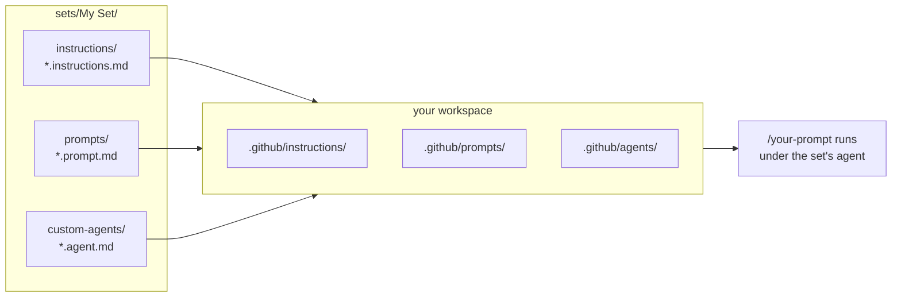

# Custom sets

A set is a folder of resources that belong together. Instead of picking one prompt here and one agent there, you install the whole bundle and get a workflow that was designed as a unit.

Each set can mix any of the resource types in this repo: instructions, prompt templates, custom agents, chat modes, skills. A prompt in a set usually names the agent it runs under, and the agent usually assumes the instructions from the same folder are loaded. That is the point of grouping them.

> [!WARNING]
> Sets are a convention in this repository, not a VS Code Copilot feature. There is no "install set" button. You copy the files you want into your workspace.

## How a set is put together



## Folder layout

```
sets/
  <Set name>/
    README.md            what the set does and how to run it
    instructions/
    prompts/
    custom-agents/
    skills/
```

Only `README.md` matters structurally. Everything else is discovered by file extension, so subfolders are up to you. [scripts/regenerate-readme.js](../scripts/regenerate-readme.js) walks each set folder recursively, reads the title and description from its `README.md`, and rebuilds the Custom Sets table in the root [README.md](../README.md).

## Using a set

1. Open the set's `README.md` and read its "How to use" section. Sets differ.
2. Copy the resources into the matching `.github/` folders in your workspace, or use the install badges from the root README table.
3. Run the set's entry-point prompt.

You can also take a single file out of a set and ignore the rest. It will work on its own, just without the context the other pieces were written to provide.

## Adding a set

Create a folder under `sets/`, drop your resources in, and write a `README.md` with an H1 title and a short description. Then run:

```bash
npm run generate
```

See [CONTRIBUTING.md](../CONTRIBUTING.md) for frontmatter rules and linting.
